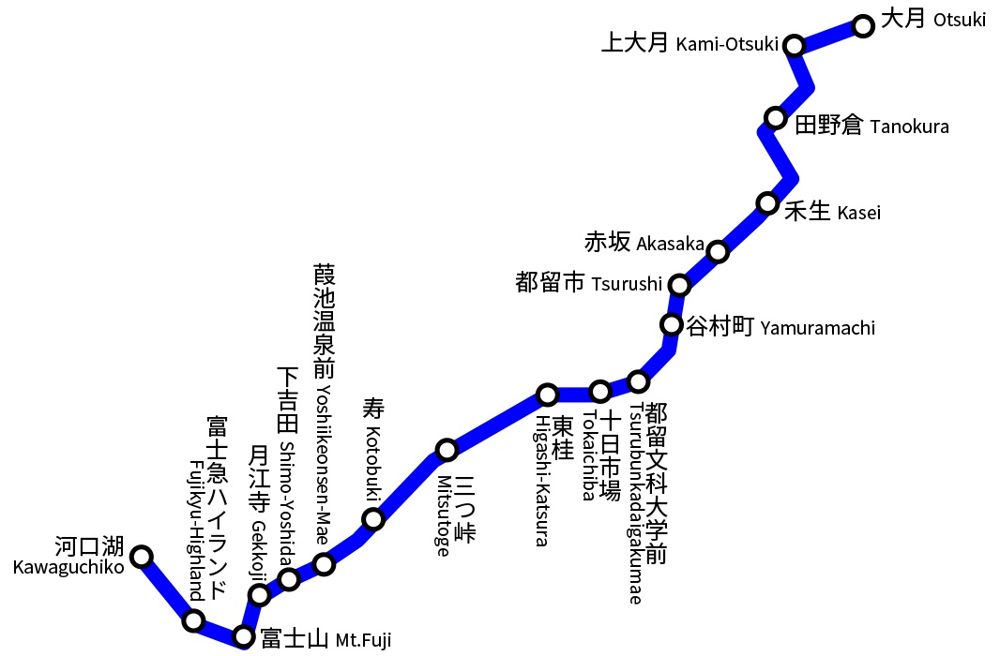

# 中部 (ちゅうぶ)
- ### [新潟県 (にいがたけん)](niigata.md)
- ### [富山県 (とやまけん)](toyama.md)
- ### [石川県 (いしかわけん)](ishikawa.md)
- ### [福井県 (ふくいけん)](fukui.md)
- ### [長野県 (ながのけん)](nagano.md)
- ### [岐阜県 (ぎふけん)](gifu.md)
- ### [山梨県 (やまなしけん)](yamanashi.md)
- ### [静岡県 (しずおかけん)](shizuoka.md)
- ### [愛知県 (あいちけん)](aichi.md)
- ### [三重県 (みえけん)](mie.md)

# 中京圏 (ちゅうきょうけん)、名古屋圏 (なごやけん)
- ### [名古屋](aichi.md#名古屋市-なごやし)を中心とする都市圏

# 富士急行 (ふじきゅうこう)

- ### [富士急ハイランド](yamanashi.md#富士急ハイランド-ふじきゅう-はいらんど)
