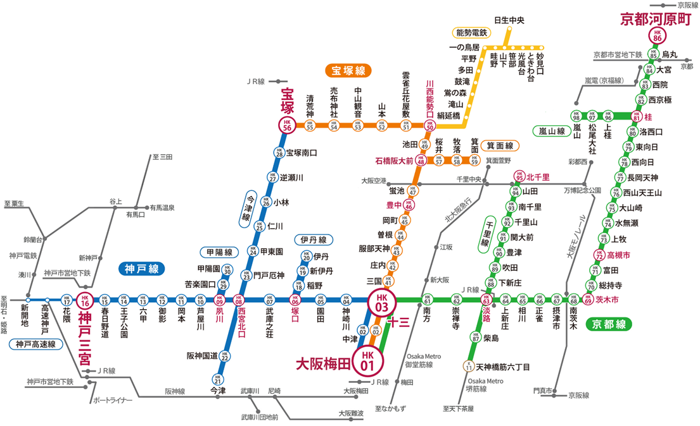
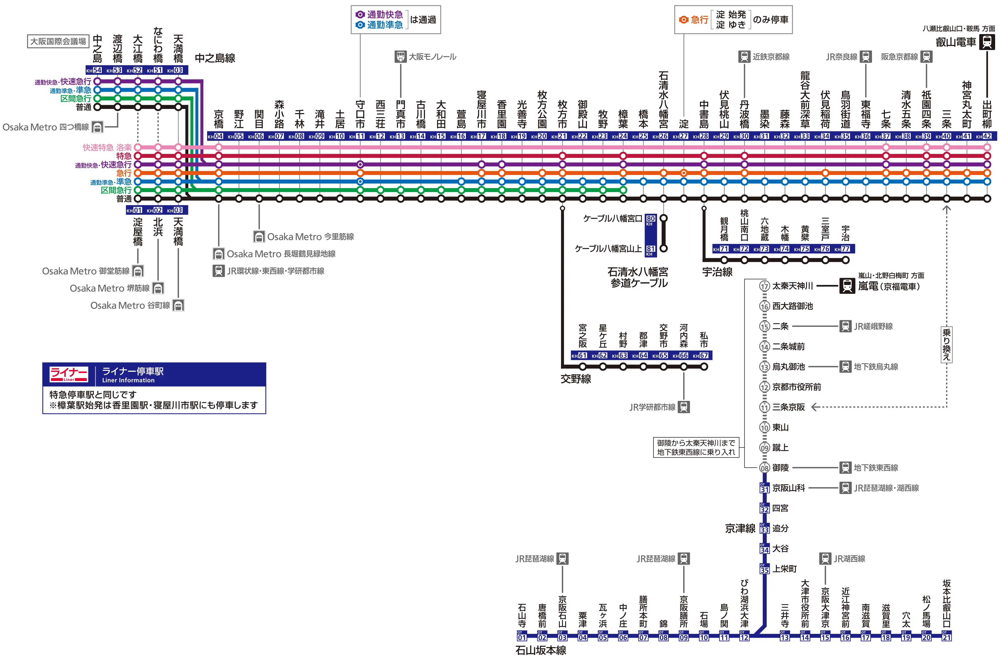
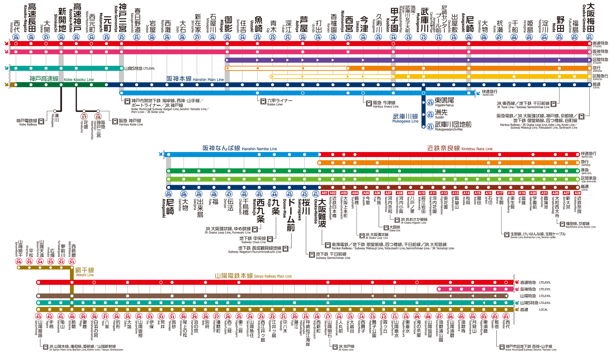

# 近畿 (きんき)、関西 (かんさい)
- ### [大阪府 (おおさかふ)](osaka.md)
- ### [京都府 (きょうとふ)](kyoto.md)
- ### [奈良県 (ならけん)](nara.md)
- ### [兵庫県 (ひょうごけん)](hyogo.md)
- ### [滋賀県 (しがけん)](shiga.md)
- ### [和歌山県 (わかやまけん)](wakayama.md)

# 京阪神 (けいはんしん)
- ### [京都](kyoto.md)
- ### [大阪](osaka.md)
- ### [神戸](hyogo.md#神戸市-こうべし)

# 阪急電鉄 (はんきゅうでんてつ)

# 京阪電気鉄道 (けいはんでんきてつどう)

- ### [京都](kyoto.md) → [大阪](osaka.md)

# 阪神電気鉄道 (はんしんでんきてつどう)

- ### [大阪](osaka.md) → [神戸](hyogo.md#神戸市-こうべし)
