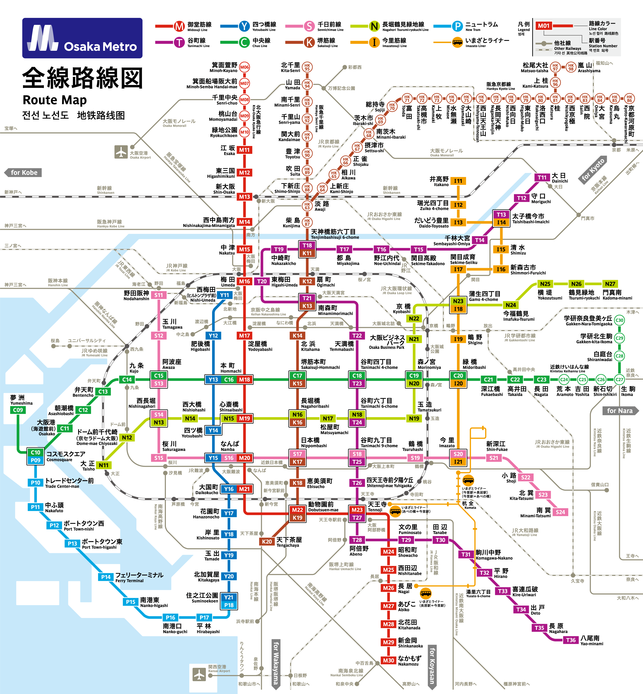

# 大阪市 (おおさかし)
- ### 梅田 (うめだ)
    - #### 大丸 梅田店 (だいまる うめだみせ)
        - Nintendo OSAKA
        - ポケモンセンターオーサカ (Pokemon Center Osaka)
        - CAPCOM Store & Cafe Umeda
    - #### 阪神梅田本店 (はんしんうめだほんてん)
    - #### 阪急三番街 (はんきゅう さんばんがい)
        - hololive production official shop in Osaka Umeda
    - #### NU茶屋町 (NUちゃやまち)
        - アニメイト梅田
        - TOHO entertainment STORE
    - #### 梅田スカイビル
- ### 心斎橋 (しんさいばし)
    - #### 心斎橋筋商店街 (しんさいばしすじ しょうてんがい)
    - #### 大丸 心斎橋店 (だいまる しんさいばしみせ)
    - #### 心斎橋PARCO
        - CAPCOM STORE OSAKA
- ### 難波 (なんば)
- ### 道頓堀 (どうとんばり)
    - #### 道頓堀グリコサイン (道頓堀 Glico Sign)
    - #### かに道楽 道頓堀本店 (かにどうらく どうとんぼりほんてん)
- ### 日本橋 (にっぽんばし)
- ### 天保山 (てんぽうざん)
    - #### 天保山大観覧車 (てんぽうざん だいかんらんしゃ)
    - #### 天保山マーケットプレース
    - #### 海遊館 (かいゆうかん)
- ### 大阪城 (おおさかじょう)
- ### 通天閣 (つうてんかく)

# 大阪市営地下鉄 (おおさかしえいちかてつ)

