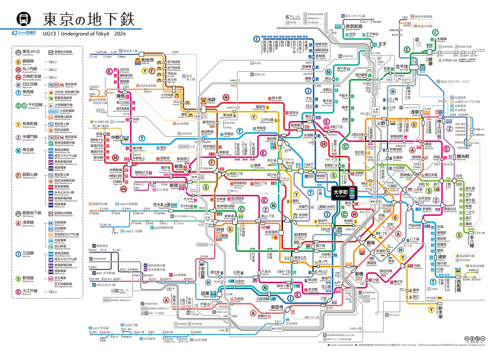
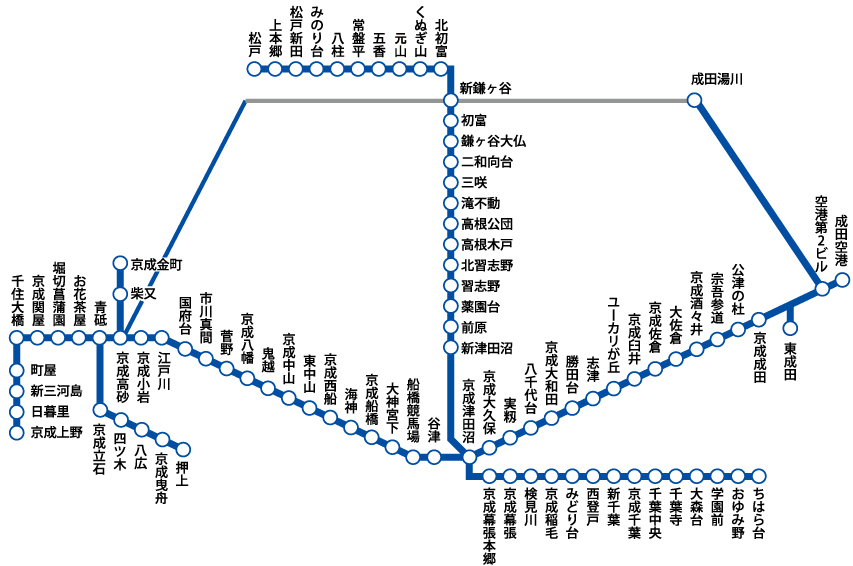

# 関東 (かんとう)
- ### [東京都 (とうきょうと)](tokyo.md)
- ### [神奈川県 (かながわけん)](kanagawa.md)
- ### [千葉県 (ちばけん)](chiba.md)
- ### [埼玉県 (さいたまけん)](saitama.md)
- ### [群馬県 (ぐんまけん)](gunma.md)
- ### [栃木県 (とちぎけん)](tochigi.md)
- ### [茨城県 (いばらきけん)](ibaraki.md)

# 首都圏 (しゅとけん)
- ### [東京](tokyo.md)
- ### [神奈川](kanagawa.md)
- ### [千葉](chiba.md)
- ### [埼玉](saitama.md)

# 関東平野 (かんとうへいや)

# 東京メトロ (Tokyo Metro)

# 京成電鉄 (けいせいでんてつ)

- ### 京成：[東京](tokyo.md) → [成田](chiba.md#成田市-なりたし)

# 東急電鉄 (とうきゅうでんてつ)

