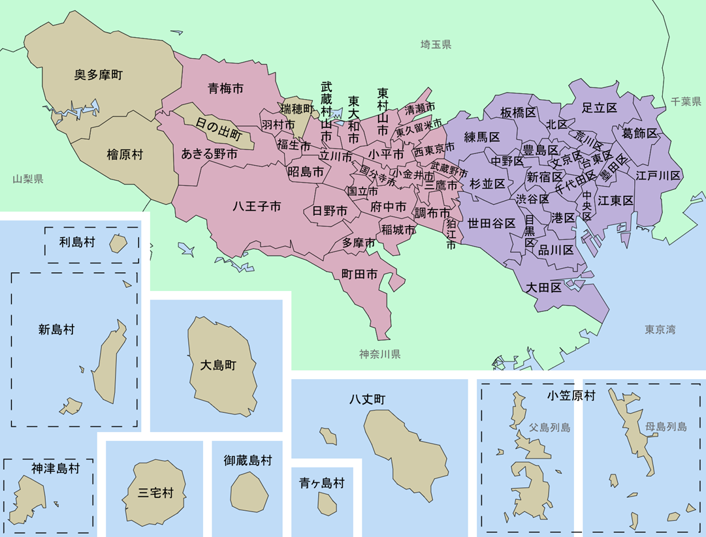
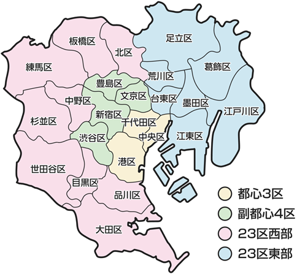
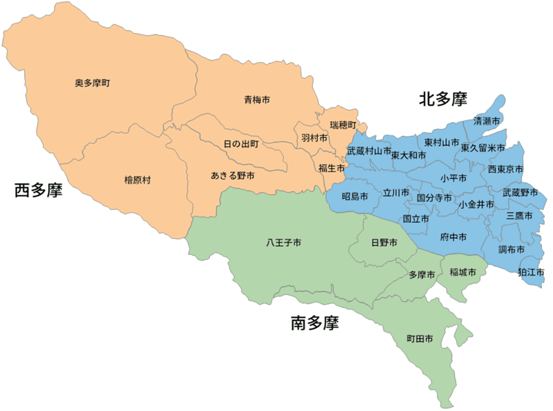

# 東京都 (とうきょうと)

- ### [東京23区 (特別区)](#東京23区-特別区-1)
    
- ### 多摩地域 (たまちいき)
    

    - ### [東京26市](#東京26市-1)
    - ### [西多摩郡 (にしたまぐん)](#西多摩郡-にしたまぐん-1)
- ### [東京諸島 (とうきょうしょとう)](#東京諸島-とうきょうしょとう-1)

# 東京23区 (特別区)
- ### 中央区 (ちゅうおうく)
    - #### 銀座 (ぎんざ)
- ### 千代田区 (ちよだく)
    - #### 秋葉原 (あきはばら)
    - #### 東京国際フォーラム (とうきょう こくさい フォーラム)
    - #### 日本武道館 (にっぽん ぶどうかん)
    - #### 靖国神社 (やすくに じんじゃ)
    - #### 神田明神 (かんだみょうじん)
    - #### 東京大神宮 (とうきょうだいじんぐう)
- ### 港区 (みなとく)
    - #### 青山 (あおやま)
    - #### 東京タワー (Tokyo Tower)
    - #### 慶応義塾大学 (けいおうぎじゅくだいがく)
- ### 渋谷区 (しぶやく)
    - #### 原宿 (はらじゅく)
    - #### 恵比寿 (えびす)
    - #### 渋谷スカイ (SHIBUYA SKY)
    - #### 忠犬ハチ公像 (ちゅうけんはちこうぞう)
    - #### 明治神宮 (めいじじんぐう)
    - #### 代々木公園 (よよぎ こうえん)
    - #### MIYASHITA PARK
- ### 新宿区 (しんじゅくく)
    - #### 早稲田大学 (わせだだいがく)
    - #### 須賀神社 (すがじんじゃ)
- ### 文京区 (ぶんきょうく)
    - #### 東京ドーム (TOKYO DOME)
    - #### 東京大学 (とうきょうだいがく)
- ### 豊島区 (としまく)
    - #### 池袋 (いけぶくろ)
        - アニメイト池袋本店 (アニメイト いけぶくろ ほんてん)
- ### 台東区 (たいとうく)
    - #### 浅草 (あさくさ)
        - 浅草寺 (せんそうじ)
    - #### 上野 (うえの)
        - 上野恩賜公園 (うえのおんし こうえん)
        - 東京国立博物館 (とうきょう こくりつ はくぶつかん)
    - #### アメヤ 横丁 (あめや よこちょう)
- ### 墨田区 (すみだく)
    - #### 東京スカイツリー (TOKYO SKYTREE)
- ### 江東区 (こうとうく)
    - #### 豊洲 (とよす)
- ### 品川区 (しながわく)
    - #### 大崎 (おおさき)
    - #### 五反田 (ごたんだ)
- ### 目黒区 (めぐろく)
- ### 大田区 (おおたく)
    - #### 羽田 (はねだ)
        - 東京国際空港 (とうきょう こくさい くうこう)、羽田空港 (はねだ くうこう)
- ### 世田谷区 (せたがやく)
    - #### 下北沢 (しもきたざわ)
- ### 杉並区 (すぎなみく)
- ### 中野区 (なかのく)
    - #### 中野ブロードウェイ (Nakano Broadway)
- ### 練馬区 (ねりまく)
- ### 板橋区 (いたばしく)
- ### 北区 (きたく)
- ### 荒川区 (あらかわく)
- ### 足立区 (あだちく)
- ### 葛飾区 (かつしかく)
- ### 江戸川区 (えどがわく)

# 東京26市
- ### 青梅市 (おうめし)
- ### あきる野市 (あきるのし)
- ### 八王子市 (はちおうじし)
    - #### 高尾山 (たかおさん)
- ### 町田市 (まちだし)
- ### 羽村市 (はむらし)
- ### 福生市 (ふっさし)
- ### 昭島市 (あきしまし)
- ### 日野市 (ひのし)
- ### 多摩市 (たまし)
- ### 立川市 (たちかわし)
- ### 国立市 (くにたちし)
- ### 国分寺市 (こくぶんじし)
- ### 府中市 (ふちゅうし)
- ### 稲城市 (いなぎし)
- ### 清瀬市 (きよせし)
- ### 西東京市 (にしとうきょうし)
- ### 小平市 (こだいらし)
- ### 小金井市 (こがねいし)
- ### 三鷹市 (みたかし)
- ### 調布市 (ちょうふし)
- ### 狛江市 (こまえし)
- ### 東久留米市 (ひがしくるめし)
- ### 東村山市 (ひがしむらやまし)
- ### 東大和市 (ひがしやまとし)
- ### 武蔵野市 (むさしのし)
- ### 武蔵村山市 (むさしむらやまし)

# 西多摩郡 (にしたまぐん)
- ### 奥多摩町 (おくたままち)
- ### 日の出町 (ひのでまち)
- ### 瑞穂町 (みずほまち)
- ### 檜原村 (ひのはらむら)

# 東京諸島 (とうきょうしょとう)
- ### 伊豆諸島 (いずしょとう)
    - #### 伊豆大島 (いずおおしま)
    - #### 利島 (としま)
    - #### 新島 (にいじま)
    - #### 式根島 (しきねじま)
    - #### 神津島 (こうづしま)
    - #### 三宅島 (みやけじま)
    - #### 御蔵島 (みくらじま)
    - #### 八丈島 (はちじょうじま)
    - #### 青ヶ島 (あおがしま)
- ### 小笠原諸島 (おがさわらしょとう)
    - #### 父島列島 (ちちじまれっとう)
    - #### 母島列島 (ははじまれっとう)

# 
