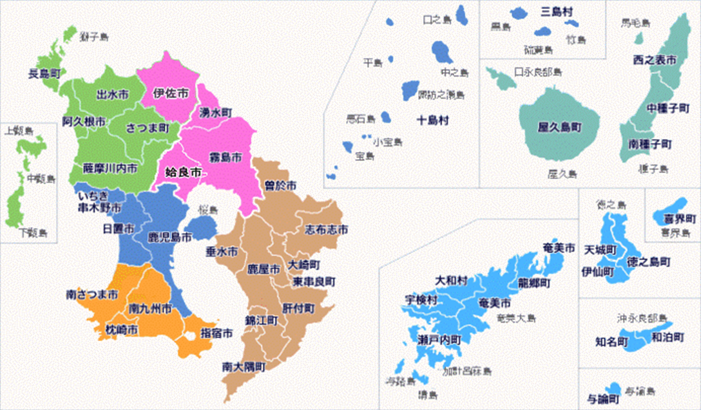

# 鹿児島県 (かごしまけん)

- ### 大隅半島 (おおすみはんとう)：鹿児島県東部
    - #### 桜島 (さくらじま)
- ### 薩摩半島 (さつまはんとう)：鹿児島県西部
- ### 薩南諸島 (さつなん しょとう)
    - #### 大隅諸島 (おおすみしょとう)
        - 種子島 (たねがしま)
        - 屋久島 (やくしま)
    - #### トカラ列島
    - #### 奄美群島 (あまみぐんとう)

# 霧島市 (きりしまし)
- ### 霧島神宮 (きりしまじんぐう)
