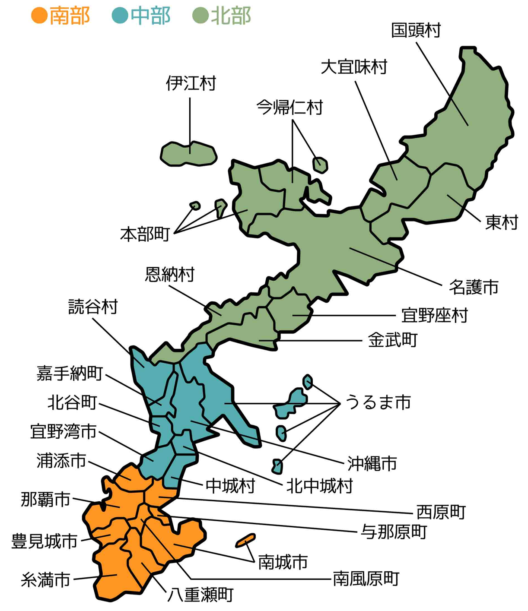
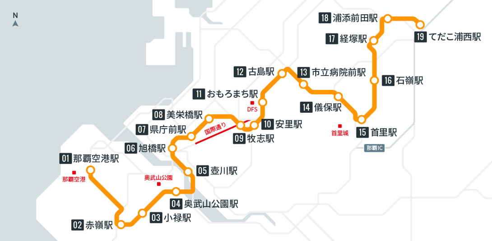

# 沖縄本島 (おきなわほんとう)

# 沖縄市 (おきなわし)

# 那覇市 (なはし)
- ### 那覇空港 (なはくうこう)
- ### 赤嶺 (あかみね)
    - #### マンガ倉庫那覇店 (マンガそうこ なはてん)
- ### 小禄 (おろく)
    - #### イオン那覇店 (AEON那覇店)
- ### 奥武山公園 (おうのやまこうえん)
    - #### 沖宮 (おきのぐう)
- ### 旭橋 (あさひばし)
    - #### 那覇オーパ (Naha OPA)
    - #### 波上宮 (なみのうえぐう)
- ### 県庁前交差点 (けんちょうまえ こうさてん)
    - #### 国際通り (こくさいとおり)
    - #### パレットくもじ
- ### おもろまち
    - #### サンエー那覇メインプレイス (SAN-A NAHA MAIN PLACE)
- ### 古島 (ふるじま)
    - #### 出雲大社沖縄分社 (いずもたいしゃ おきなわぶんしゃ)
- ### 首里 (しゅり)
    - #### 首里城 (しゅりじょう)

# 浦添市 (うらそえし)
- ### サンエー浦添西海岸パルコシティ (SAN-A URASOE WEST COAST PARCO CITY)

# 豊見城市 (とみぐすくし)
- ### 瀬長島 (せながじま)
- ### 沖縄アウトレットモール あしびなー (OKINAWA OUTLET MALL ASHIBINAA)
- ### DMM かりゆし水族館 (ディーエムエム かりゆし すいぞくかん)

# 南城市 (なんじょうし)
- ### おきなわワールド (Okinawa World)
    - #### 玉泉洞 (ぎょくせんどう)
- ### 新原ビーチ (みーばるビーチ)

# 国頭郡 (くにがみぐん)
- ### 沖縄美ら海水族館 (おきなわちゅらうみすいぞくかん)
- ### 青の洞窟 (あおのどうくつ)

# 中頭郡 (なかがみぐん)
- ### 美浜タウンリゾート アメリカンビレッジ (Mihama Town Resort American Village)
- ### イオンモール沖縄ライカム (AEON MALL OKINAWA RYCOM)

# 沖縄都市モノレール (ゆいレール)

