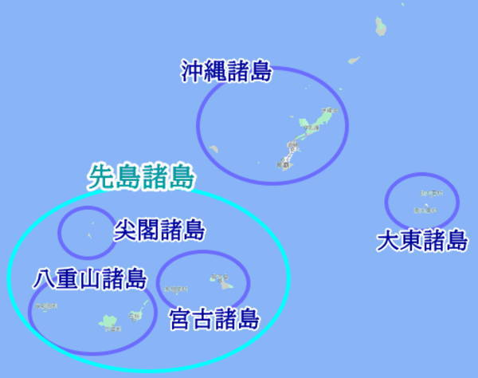

# 沖縄県 (おきなわけん)

- ### 琉球諸島 (りゅうきゅう しょとう)
    - ### 沖縄諸島 (おきなわ しょとう)
        - #### [沖縄本島 (おきなわ ほんとう)](okinawa-island.md)
    - ### [先島諸島 (さきしま しょとう)](#先島諸島-さきしましょとう-1)
- ### 大東諸島 (だいとう しょとう)

# 先島諸島 (さきしま しょとう)
- ### 宮古列島 (みやこ れっとう)
- ### 八重山列島 (やえやま れっとう)
    - #### 石垣島 (いしがきじま)
    - #### 西表島 (いりおもてじま)
- ### 尖閣諸島 (せんかく しょとう)
