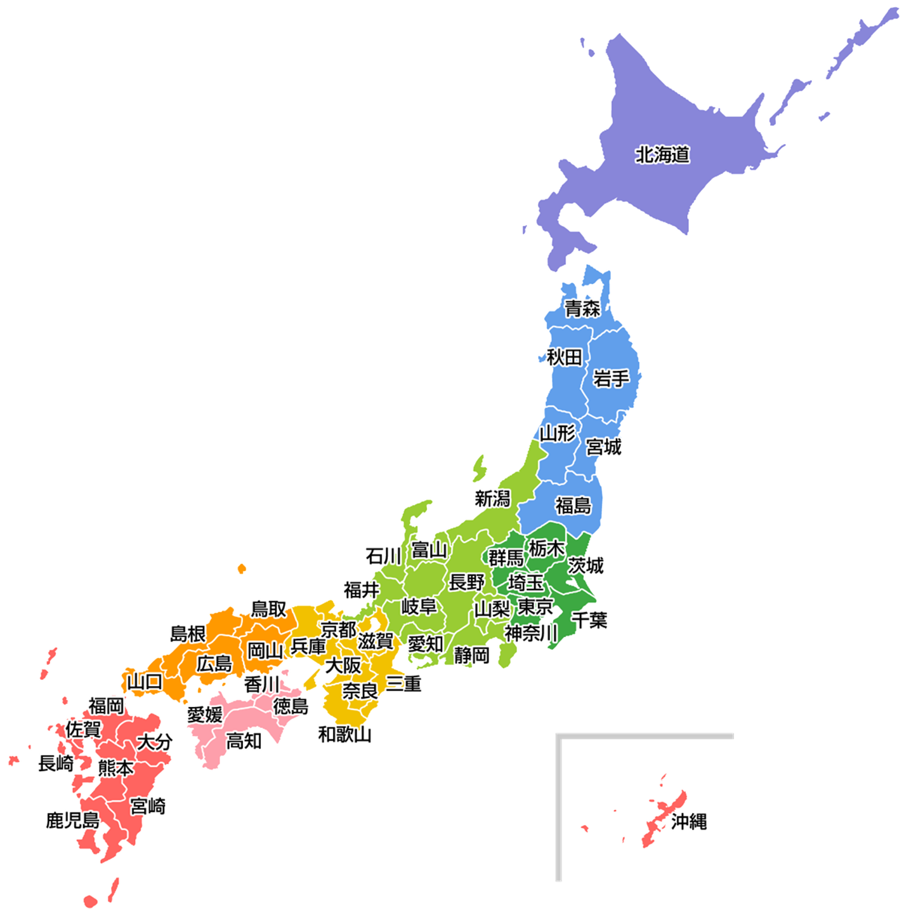

- ### [都道府県](#1都1道2府43県) > [市区町村](#市区町村-しくちょうそん基礎自治体-きそじちたい) > [丁目](#丁目-ちょうめ) > [番地](#番地-ばんち) > [号](#号-ごう)

# 1都1道2府43県
- ### 都 (と)：東京都
    - ### [特別区 (とくべつく)](#特別区とくべつく-1)
    - ### [市 (し)](#市し-4)
    - ### [郡 (ぐん)](#郡ぐん-4)
- ### 道 (どう)：北海道
    - ### [市 (し)](#市し-4)
    - ### [郡 (ぐん)](#郡ぐん-4)
- ### 府 (ふ)：[京都府](honshu/kansai/kyoto.md)、[大阪府](honshu/kansai/osaka.md)
    - ### [市 (し)](#市し-4)
    - ### [郡 (ぐん)](#郡ぐん-4)
- ### 県 (けん)
    - ### [市 (し)](#市し-4)
    - ### [郡 (ぐん)](#郡ぐん-4)

# 市区町村 (しくちょうそん)、基礎自治体 (きそじちたい)
- ### 特別区 (とくべつく)
    - #### [町 (ちょう、まち)](#町-ちょうまち-2)
- ### 市 (し)
    - #### 行政区 (ぎょうせいく)
        - [町 (ちょう、まち)](#町-ちょうまち-2)
- ### 郡 (ぐん)
    - #### [町 (ちょう、まち)](#町-ちょうまち-2)
    - #### 村 (むら、そん)
- ### 町 (ちょう、まち)
    - [丁目 (ちょうめ)](#丁目-ちょうめ)

# 丁目、番地、号
- ### 丁目 (ちょうめ)
- ### 番地 (ばんち)
- ### 号 (ごう)

# 日本の地域 (にほんのちいき)

- ### 北海道 (ほっかいどう)
- ### 本州 (ほんしゅう)
    - ### 東北 (とうほく)
    - ### 関東 (かんとう)
    - ### 中部 (ちゅうぶ)
    - ### [近畿 (きんき)、関西 (かんさい)](honshu/kansai/kansai.md)
    - ### 中国 (ちゅうごく)
- ### 四国 (しこく)
- ### 九州 (きゅうしゅう)

# 令制国
- ### [令制国](provinces-of-japan.md)

# 住民
- ### 道民 (どうみん)＝北海道の住民
- ### 都民 (とみん)＝東京都の住民
