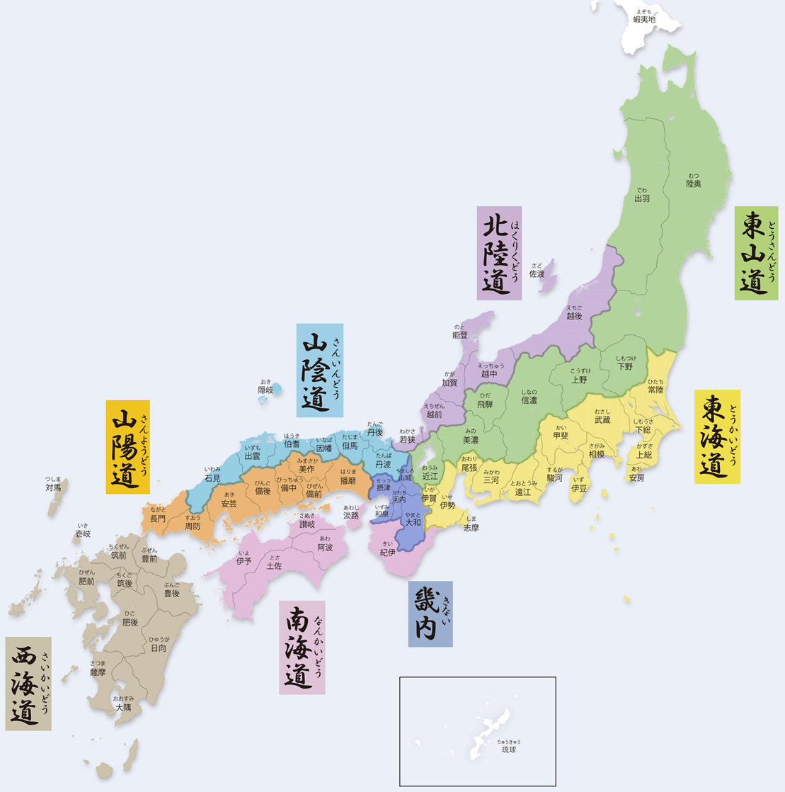
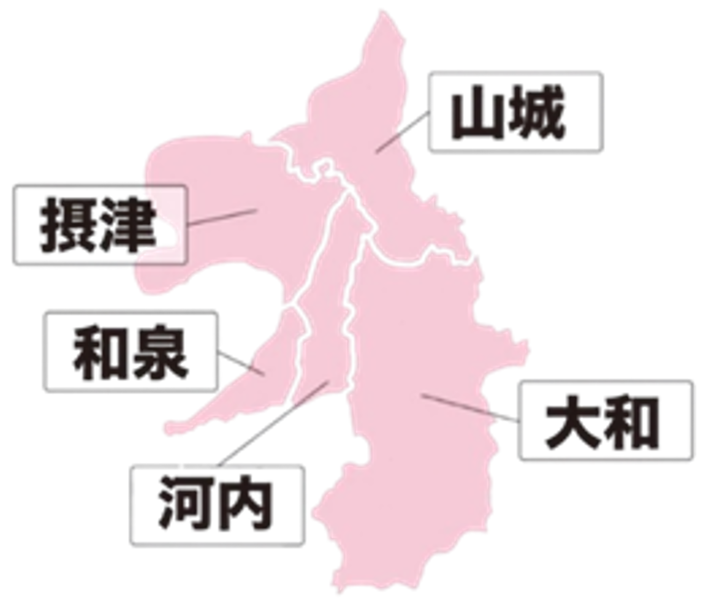
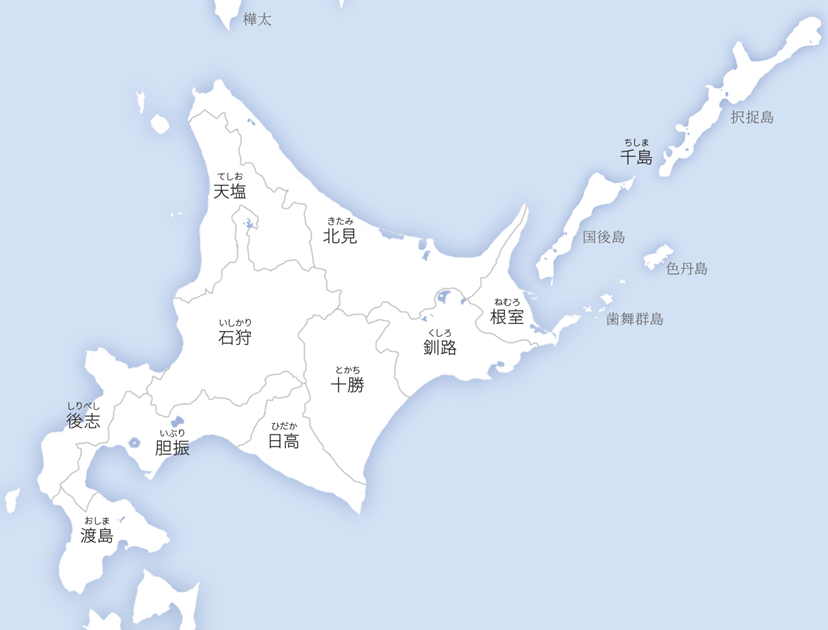

# 令制国 (りょうせいこく)
- ### 五畿七道 (ごきしちどう)
    

    - ### [五畿 (ごき)、畿内 (きない)](#五畿-ごき畿内-きない近畿-関西)
    - ### [七道 (しちどう)](shichido.md)
- ### [北海道](#北海道-ほっかいどう)

# 五畿 (ごき)、畿内 (きない)：[近畿 (関西)](../honshu/kansai/kansai.md)

- ### 山城国 (やましろのくに)：[京都府](../honshu/kansai/kyoto.md)南部
- ### 河内国 (かわちのくに)：[大阪府](../honshu/kansai/osaka.md)東部
- ### 摂津国 (せっつのくに)：[大阪府](../honshu/kansai/osaka.md)北西部、[兵庫県](../honshu/kansai/hyogo.md)南東部
- ### 和泉国 (いずみのくに)：[大阪府](../honshu/kansai/osaka.md)南西部
- ### 大和国 (やまとのくに)：[奈良県](../honshu/kansai/nara.md)

# [北海道 (ほっかいどう)](../hokkaido/hokkaido.md)

- ### 渡島国 (おしまのくに)
- ### 後志国 (しりべしのくに)
- ### 胆振国 (いぶりのくに)
- ### 日高国 (ひだかのくに)
- ### 石狩国 (いしかりのくに)
- ### 天塩国 (てしおのくに)
- ### 北見国 (きたみのくに)
- ### 十勝国 (とかちのくに)
- ### 釧路国 (くしろのくに)
- ### 根室国 (ねむろのくに)
- ### 千島国 (ちしまのくに)
