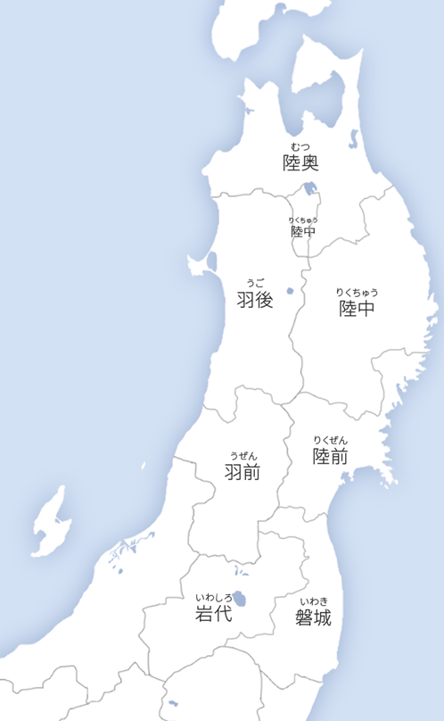

# 東海道 (とうかいどう)
- ### 伊賀国 (いがのくに)：[三重県](../honshu/chubu/mie.md)北西部 ([伊賀市](../honshu/chubu/mie.md#伊勢市-いせし)、[名張市](../honshu/chubu/mie.md#名張市-なばりし))
- ### 伊勢国 (いせのくに)：[三重県](../honshu/chubu/mie.md)中部、[三重県](../honshu/chubu/mie.md)北部
- ### 志摩国 (しまのくに)：[三重県東部 (志摩半島)](../honshu/chubu/mie.md#志摩半島-しまはんとう三重県東部)
- ### 尾張国 (おわりのくに)：[愛知県](../honshu/chubu/aichi.md)西部
- ### 三河国 (みかわのくに)：[愛知県](../honshu/chubu/aichi.md)中部、[愛知県](../honshu/chubu/aichi.md)東部
- ### 遠江国 (とおとうみのくに)：[静岡県](../honshu/chubu/shizuoka.md)西部
- ### 駿河国 (するがのくに)：[静岡県](../honshu/chubu/shizuoka.md)中部
- ### 伊豆国 (いずのくに)：[静岡県東部 (伊豆半島)](../honshu/chubu/shizuoka.md#伊豆半島-いずはんとう静岡県東部)、[東京都伊豆諸島](../honshu/kanto/tokyo.md#伊豆諸島-いずしょとう)
- ### 甲斐国 (かいのくに)：[山梨県](../honshu/chubu/yamanashi.md)
- ### 相模国 (さがみのくに)：[神奈川県](../honshu/kanto/kanagawa.md) (北東部を除く)
- ### 武藏国 (むさしのくに)：[埼玉県](../honshu/kanto/saitama.md)、[東京都](../honshu/kanto/tokyo.md) ([東京諸島](../honshu/kanto/tokyo.md#東京諸島-とうきょうしょとう-1)を除く)、[神奈川県](../honshu/kanto/kanagawa.md)北東部 ([川崎市](../honshu/kanto/kanagawa.md#川崎市-かわさきし)、[横浜市](../honshu/kanto/kanagawa.md#横浜市-よこはまし))
- ### 安房国 (あわのくに)：[千葉県](../honshu/kanto/chiba.md)南部
- ### 上總国 (かずさのくに)：[千葉県](../honshu/kanto/chiba.md)中部
- ### 下總国 (しもうさのくに)：[千葉県](../honshu/kanto/chiba.md)北部、[茨城県](../honshu/kanto/ibaraki.md)南西部
- ### 常陸国 (ひたちのくに)：[茨城県](../honshu/kanto/ibaraki.md) (南西部を除く)

# 東山道 (とうさんどう)
- ### 近江国 (おうみのくに)：[滋賀県](../honshu/kansai/shiga.md)
    - #### [近江牛 (おうみぎゅ)](../honshu/kansai/shiga.md#近江牛-おうみぎゅ)
- ### 美濃国 (みののくに)：[岐阜県](../honshu/chubu/gifu.md)南部
- ### 飛騨国 (ひたのくに)：[岐阜県](../honshu/chubu/gifu.md)北部
- ### 信濃国 (しなののくに)：[長野県](../honshu/chubu/nagano.md)
- ### 上野国 (こうずけのくに)：[群馬県](../honshu/kanto/gunma.md)
- ### 下野国 (しもつけのくに)：[栃木県](../honshu/kanto/tochigi.md)
- ### 奥羽 (おうう)
    

    - #### 陸奥国 (むつのくに、みちのくに)
        - 岩代国 (いわしろのくに)：[福島県](../honshu/tohoku/fukushima.md)西部、[福島県](../honshu/tohoku/fukushima.md)中部
        - 磐城国 (いわきのくに)：[福島県](../honshu/tohoku/fukushima.md)東部、[宮城県](../honshu/tohoku/miyagi.md)南部
        - 陸前国 (りくぜんのくに)：[宮城県](../honshu/tohoku/miyagi.md) (南部を除く)、[岩手県](../honshu/tohoku/iwate.md)南東部
        - 陸中国 (りくちゅうのくに)：[岩手県](../honshu/tohoku/iwate.md) (南東部と北西部を除く)、[秋田県](../honshu/tohoku/akita.md)北東部
        - 陸奥国 (分立後)：[岩手県](../honshu/tohoku/iwate.md)北西部、[青森県](../honshu/tohoku/aomori.md)
    - #### 出羽国 (でわのくに)
        - 羽前国 (うぜんのくに)：[山形県](../honshu/tohoku/yamagata.md) (北西部を除く)
        - 羽後国 (うごのくに)：[山形県](../honshu/tohoku/yamagata.md)北西部、[秋田県](../honshu/tohoku/akita.md) (北東部を除く) 

# 北陸道 (ほくりくどう)
- ### 若狭国 (わかさのくに)：[福井県](../honshu/chubu/fukui.md)南部 ([嶺南](../honshu/chubu/fukui.md#嶺南-れいなん))
- ### 越前国 (えちぜんのくに)：[福井県](../honshu/chubu/fukui.md)北部 ([嶺北](../honshu/chubu/fukui.md#嶺北-れいほく))
- ### 加賀国 (かがのくに)：[石川県](../honshu/chubu/ishikawa.md) ([能登半島](../honshu/chubu/ishikawa.md#能登半島-のとはんとう石川県北部)を除く)
- ### 能登国 (のとのくに)：[石川県北部 (能登半島)](../honshu/chubu/ishikawa.md#能登半島-のとはんとう石川県北部)
- ### 越中国 (えっちゅうのくに)：[富山県](../honshu/chubu/toyama.md)
- ### 越後国 (えちごのくに)：[新潟県](../honshu/chubu/niigata.md) ([佐渡島](../honshu/chubu/niigata.md#佐渡島-さどしま佐渡市-さどし)を除く)
- ### 佐渡国 (さどのくに)：[新潟県佐渡島 (佐渡市)](../honshu/chubu/niigata.md#佐渡島-さどしま佐渡市-さどし)

# 山陰道 (さんいんどう)
- ### 丹波国 (たんばのくに)：[京都府](../honshu/kansai/kyoto.md)中部、[兵庫県](../honshu/kansai/hyogo.md)中東部 ([丹波市](../honshu/kansai/hyogo.md#丹波市-たんばし)、[丹波篠山市](../honshu/kansai/hyogo.md#丹波篠山市-たんばささやまし))
- ### 丹後国 (たんごのくに)：[京都府](../honshu/kansai/kyoto.md)北部
- ### 但馬国 (たじまのくに)：[兵庫県](../honshu/kansai/hyogo.md)北部
- ### 因幡国 (いなばのくに)：[鳥取県](../honshu/chugoku/tottori.md)東部
- ### 伯耆国 (ほうきのくに)：[鳥取県](../honshu/chugoku/tottori.md)中部、[鳥取県](../honshu/chugoku/tottori.md)西部
- ### 出雲国 (いずものくに)：[島根県](../honshu/chugoku/shimane.md)東部
- ### 石見国 (いわみのくに)：[島根県](../honshu/chugoku/shimane.md)西部
- ### 隠岐国 (おきのくに)：[島根県隠岐諸島 (隠岐郡)](../honshu/chugoku/shimane.md#隠岐諸島-おきしょとう隠岐郡-おきぐん)

# 山陽道 (さんようどう)
- ### 播磨国 (はりまのくに)：[兵庫県](../honshu/kansai/hyogo.md)南部 (南東部を除く)
- ### 美作国 (みまさかのくに)：[岡山県](../honshu/chugoku/okayama.md)北東部
- ### 備前国 (びぜんのくに)：[岡山県](../honshu/chugoku/okayama.md)南東部
- ### 備中国 (びっちゅうのくに)：[岡山県](../honshu/chugoku/okayama.md)西部
- ### 備後国 (びんごのくに)：[広島県](../honshu/chugoku/hiroshima.md)東部
- ### 安芸国 (あきのくに)：[広島県](../honshu/chugoku/hiroshima.md)西部
- ### 周防国 (すおうのくに)：[山口県](../honshu/chugoku/yamaguchi.md)東部、[山口県](../honshu/chugoku/yamaguchi.md)中部
- ### 長門国 (ながとのくに)：[山口県](../honshu/chugoku/yamaguchi.md)西部

# 南海道 (なんかいどう)
- ### 紀伊国 (きいのくに)：[和歌山県](../honshu/kansai/wakayama.md)、[三重県](../honshu/chubu/mie.md)南部
- ### 淡路国 (あわじのくに)：[兵庫県淡路島](../honshu/kansai/hyogo.md#淡路島-あわじしま)
- ### 阿波国 (あわのくに)：[徳島県](../shikoku/tokushima.md)
- ### 讃岐国 (さぬきのくに)：[香川県](../shikoku/kagawa.md)
    - #### [讃岐うどん (さぬきうどん)](../shikoku/kagawa.md#讃岐うどん-さぬきうどん)
- ### 伊予国 (いよのくに)：[愛媛県](../shikoku/ehime.md)
- ### 土佐国 (とさのくに)：[高知県](../shikoku/kochi.md)

# 西海道 (さいかいどう)
- ### 筑前国 (ちくぜんのくに)：[福岡県](../kyushu/fukuoka.md)北西部
    - #### [筑前煮 (ちくぜんに)](../kyushu/fukuoka.md#筑前煮-ちくぜんに)
- ### 筑後国 (ちくごのくに)：[福岡県](../kyushu/fukuoka.md)南部
- ### 豊前国 (ぶぜんのくに)：[福岡県](../kyushu/fukuoka.md)北東部、[大分県](../kyushu/oita.md)北西部
- ### 豊後国 (ぶんごのくに)：[大分県](../kyushu/oita.md) (北西部を除く)
- ### 肥前国 (ひぜんのくに)：[佐賀県](../kyushu/saga.md)、[長崎県](../kyushu/nagasaki.md) ([壱岐島](../kyushu/nagasaki.md#壱岐島-いきのしま壱岐市-いきし)と[対馬島](../kyushu/nagasaki.md#対馬-つしま対馬市-つしまし)を除く)
- ### 肥後国 (ひごのくに)：[熊本県](../kyushu/kumamoto.md)
- ### 日向国 (ひゅうがのくに)：[宮崎県](../kyushu/miyazaki.md)
- ### 大隅国 (おおすみのくに)：[鹿児島県東部 (大隅半島)](../kyushu/kagoshima.md#大隅半島-おおすみはんとう鹿児島県東部)、[鹿児島大隅諸島](../kyushu/kagoshima.md#大隅諸島-おおすみしょとう)
- ### 薩摩国 (さつまのくに)：[鹿児島県西部 (薩摩半島)](../kyushu/kagoshima.md#薩摩半島-さつまはんとう鹿児島県西部)
- ### 壱岐国 (いきのくに)：[長崎県壱岐島 (壱岐市)](../kyushu/nagasaki.md#壱岐島-いきのしま壱岐市-いきし)
- ### 対馬国 (つしまのくに)：[長崎県対馬島 (対馬市)](../kyushu/nagasaki.md#対馬-つしま対馬市-つしまし)

# 東海 (とうかい)
- ### 東海4県
    - #### [静岡県](../honshu/chubu/shizuoka.md)
    - #### [愛知県](../honshu/chubu/aichi.md)
    - #### [岐阜県](../honshu/chubu/gifu.md)
    - #### [三重県](../honshu/chubu/mie.md)
- ### 東海3県
    - #### [愛知県](../honshu/chubu/aichi.md)
    - #### [岐阜県](../honshu/chubu/gifu.md)
    - #### [三重県](../honshu/chubu/mie.md)

# 北陸 (ほくりく)：[中部](../honshu/chubu/chubu.md)
- ### 北陸4県
    - #### [新潟県](../honshu/chubu/niigata.md)
    - #### [富山県](../honshu/chubu/toyama.md)
    - #### [石川県](../honshu/chubu/ishikawa.md)
    - #### [福井県](../honshu/chubu/fukui.md)
- ### 北陸3県
    - #### [富山県](../honshu/chubu/toyama.md)
    - #### [石川県](../honshu/chubu/ishikawa.md)
    - #### [福井県](../honshu/chubu/fukui.md)

# 甲信越：[中部](../honshu/chubu/chubu.md)
- ### [山梨 (甲斐国)](../honshu/chubu/yamanashi.md)
- ### [長野 (信濃国)](../honshu/chubu/nagano.md)
- ### [新潟 (越後国)](../honshu/chubu/niigata.md)

# 山陰山陽：[中国](../honshu/chugoku/chugoku.md)
- ### 山陰 (さんいん)
- ### 山陽 (さんよう)

