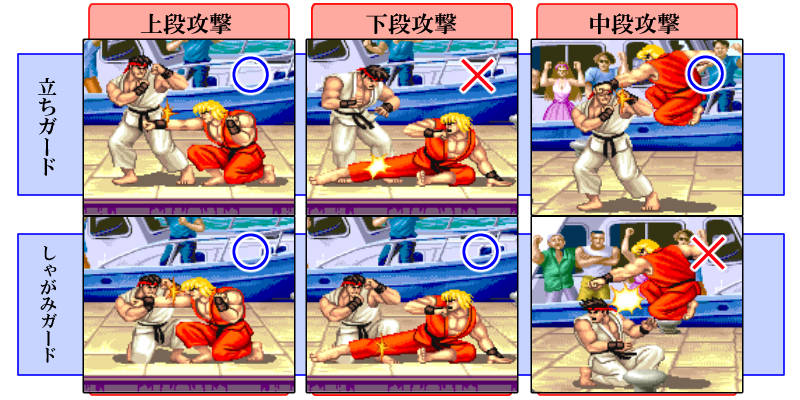
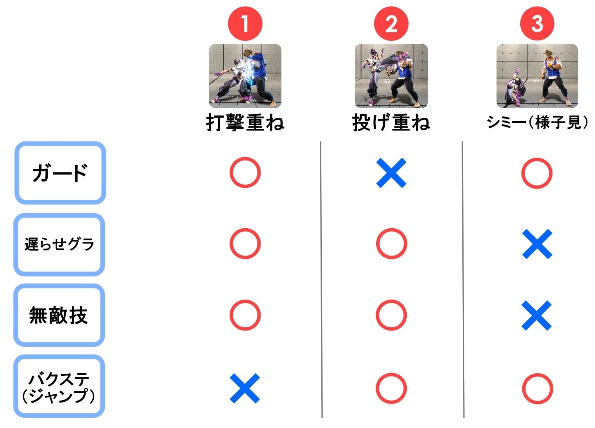

# Street Fighter 6 (SF6)
- ### Combo (コンボ)
    - #### Format：Buff + [Position](#position) + [Attack](#attack) + [Combo Type](#combo-type)
    - #### `ガード(Combo)` = Combo被防住
    - #### `X/Y` = X or Y
    - #### Combo*n = 重複此Combo n次
    - #### DR + DR = DR
    - #### CDR + DR = CDR
- ### ガード (Blocking)
    - #### 立ちガード (Standing Block, 站防)
    - #### しゃがみガード (Crouch Block, しゃがみガード)
    - #### 連ガ (連続ガード, Block String)：初の攻撃をガードした後の硬直時間中に、次の攻撃が重なることで相手が行動不能になる連係、Dリバを除く
- ### 歩き
    - #### 前歩き：6
    - #### 後ろ歩き：4
- ### ステ (Dash)
    - #### 前ステ (Forward Dash)：66
    - #### バクステ (Backward Dash)：44
- ### 補正 (ダメージ補正, Damage Scaling)
- ### Cancel (キャンセル)
    - #### Delayed Cancel (ディレイキャンセル)
- ### <span id="anti-air">対空 (Anti-Air)</span>
- ### 立ち回り：防御を固めながら相手との距離を調節する
- ### ヒット確認 (Hit Confirm)
- ### Setup (Set, セットプレイ)
    - #### Reset (補正切り)

# Direction
- ### Number Pad
    ```
    ７８９
    ４５６
    １２３
    ```
- ### 5：Standing
- ### 6：Forward
- ### 4：Backward
- ### 2：Crouching
    - #### 3：Crouch Forward
    - #### 1：Crouch Backward
- ### Jump (ジャンプ)
    - #### 9：Forward Jump (前ジャンプ)
    - #### 8：Neutral Jump (垂直ジャンプ)
    - #### 7：Backward Jump (バックジャンプ)

# Attack
- ### Attack Type
    - Punch (P)
    - Kick (K)
- ### Attack Strength
    - Light Attack (L, 弱)
    - Medium Attack (M, 中)
    - Heavy Attack (H, 強)
- ### Jump Attack (J)
    - eg：Jump Heavy Punch(JHP)
- ### Attack Attribute (攻撃の属性)
    

    - ### 上段 (High)
    - ### 中段 (Overhead)
    - ### 下段 (Low)
- ### Safe Jump (安全飛び, 詐欺飛び, 安全跳)：42F, 相手の起き上がりに合わせて特定のタイミングでジャンプ攻撃を重ねる
    - 9 + Jump Attack Combo + 4(ボタンホールド)
- ### Cross-up (めくり, 打背)：相手の背後を取りつつ攻撃することで, 相手のガードを崩すテクニック
- ### F式：しゃがみガード中の相手に対して、一瞬だけ残る「立ち状態の食らい判定」を利用し, 本来しゃがみ状態には当たらない低空ジャンプ攻撃を強制的にガードさせる「しゃがみガード不能の高速中段攻撃」

# Command
- ### Motion
    - #### Quarter Circle Forward (QCF)：236
    - #### Quarter Circle Back (QCB)：214
    - #### Z motion：623
    - #### Half Circle motion (HC, 180 motion)：624
    - #### 360 motion (G)：6248
    - #### Button hold (ボタンホールド)
        - eg：(2 + 6(Hold) + 8) + K + Release(6)
- ### 派生 (派生技, 追加技, Follow-up)
- ### 必殺技 (Special Move, SP)
    - #### 昇竜 (Dragon Punch, DR)
    - #### 弾 (飛び道具, Projectile, 波)
        - 弾抜け (穿波)
    - #### 当身 (Atemi)：相手の攻撃を受け止めて自動で反撃する特殊な防御技
    - #### 溜め技 (蓄力招)：技を出す際に一定時間方向キーを倒し続ける必要のある技
    - #### アーマー (Armor)：打撃攻撃に特定回数だけ耐えられる状態
- ### 特殊技 (Unique Attack)
- ### Super Art (SA, スーパーアーツ)
    - #### SA1, SA2, SA3
    - #### Critical Art (CA)
- ### 挑釁

# Combo Type
- ### Target Combo (TC)
- ### Air Combo
    - #### Air Combo(Juggle Combo, 浮空連段)：對手在空中
    - #### High-Air Combo：Air Combo，但高度更高
    - #### Highest-Air Combo：Air Combo，但高度比High-Air更高
- ### Extension Combo：只能接在Combo後面的Combo
- ### Carry Combo (運びコンボ, 搬運連段)：コンボ時に相手を画面端に連れて行く

# Position
- 基準
    - $wall=0,1$
    - $half=\frac{1}{2}$
    - (wall+half)的中間：$`quarter=\frac{1}{4},\frac{3}{4}`$
    - (quater+half)的中間：$`qh=\frac{3}{8},\frac{5}{8}`$
    - (wall+quater)的中間：$`wq=\frac{1}{8},\frac{7}{8}`$
- ### Opponent's Position ($x$)
    - #### Midscreen：$`quarter(\frac{1}{4})\le x\le quarter(\frac{3}{4})`$
    - #### Corner：$`x=wall`$
    - #### Near-midscreen：$`quarter\le x\le half`$
        - QHH：$`qh\le x\le half`$
        - QQH：$`quarter\le x\le qh`$
    - #### Near-corner：$`wall<x<quarter`$
    - #### Near-wall：$`wall\le x<quarter`$ = Near-corner + Corner
        - WQQ：$`wq\le x\le quarter`$
        - WWQ：$`wall\le x\le wq`$
- ### Own Position ($`m`$)
    - Back-to-Wall (BTW)：$`m=wall`$
- ### Distance from Opponent
    - Close range (Close) < Mid range (Mid) < Far range (Far)
    - Mid-close range (Mid-close)：Close ~ Mid
    - Mid-far range (Mid-far)：Mid ~ Far
- ### Side-switch (Switch)：swapping sides/directions with the opponent
    - Corner side-switch (C-Switch)：Swapping sides when your Back-to-Wall

# Drive Gauge(ドライブゲージ)
- ### Drive Impact (DI, インパクト)：26F, HP + HK
    - #### Wall Splat (壁やられ)：guarding DI while they are near the corner
    - #### Stun：wall splat with BO
- ### Drive Parry (Parry, パリィ)：MP + MK
    - #### Perfect Parry (ジャスパ, ジャストパリィ)
- ### Drive Rush (DR, ラッシュ)：Parry + Dash
    - #### Cancel Drive Rush (CDR, キャンセルラッシュ)
    - #### 生ラッシュ
    - #### ラッシュ止め (截綠衝)
- ### OverDrive (OD)
- ### Drive Reversal (Dリバ, ドライブリバーサル)：When Guard/Parry/Down, 6 + DI
- ### Burn Out (BO)
    - ### BO磨血：對手BO時，削減對手的血量
- ### ドライブゲージを削る (打動力槽)：削減對手的動力槽

# <span id="throw"> 投げ (Throw)：LP + LK </span>
- ### Direction
    - #### 前投げ (Forward Throw)：LP + LK
    - #### 後ろ投げ (Backward Throw)：4 + LP + LK
- ### Throw Escape (投げ抜け, グラップ)
- ### Command Throw (コマ投げ)
- ### Shimmy (シミー)：後退騙對手解摔，以此攻擊對手的解摔硬直

# Knocked Down (Down, ダウン, 倒地)
- ### Hard Knockdown (ハードダウン)
- ### <span id="oki"> 起き攻め (OKI, 壓起身) </span>
    - ### 持続当て (重ね, Meaty, 壓持續)
- ### 起き上がり
    - ### その場受け身 (原地起身)
    - ### 後方受け身 (後起身)：倒地時，按下兩顆手腳

# Frame (F, フレーム)
- ### 發生
- ### 硬直差
- ### <span id="frame-kill"> 消費 (Frame Kill, フレーム消費) </span>
- ### Delay (ディレイ)
    - delay(cancel) = [Delayed Cancel](#delayed-cancel-ディレイキャンセル)
    - delay(no cancel) = Delay without Cancel

# 択 (mix-up, 擇)
- ### 打摔擇 (strike/throw mix-ups)：打撃重ね、投げ重ね、シミー
    
    
    - #### 遅らせグラ (遅らせグラップ, 延遲解摔)：相手の攻撃が重なる瞬間に、ガードを入力しつつ、ごくわずかにタイミングをずらして[投げ](#投げ-throwlp--lk)ボタンを押します
- ### 中下擇：中段/下段
- ### 前後擇
- ### パナシ (Reversal, 凹)：自分が不利な状況のときに、相手の動きをよく見ず、隙の大きい強力な技や無敵技をギャンブルのように出す行為
- ### ジャンプ
    - #### 前ジャンプ
    - #### 垂直ジャンプ
    - #### バックジャンプ

# Counter
- ### Counter hit
- ### Crush Counter (CC)
- ### Punish Counter (PC, パニカン)
    - #### 4F PC
        - JP：6HK
        - Gouki：中灼火
        - Ken：弱龍尾腳, 弱迅雷
        - Vega：剪刀腳
        - Jamie：5HK
        - Chunli：弱劈腿, OD劈腿
        - Viper：2HP
        - Ingrid：5HP,6HP
    - #### 6F PC
        - Dリバ
        - JP：5MP, 2HP, 2HK, 弱弾
        - Ryu：2HP, 2MK, 弱足刀, 中足刀
        - Zangief：5MP*2
        - Jamie：2MK, 2HP, 弱推掌, 中推掌, 醉拳
    - #### 8F PC
        - JP：6HK(しゃがみガード), 中弾, 強弾, 中風神
        - Gouki：輕灼火
        - Ken：中龍尾腳, OD龍尾腳
        - Zangief：6HK
        - Lily：中蓄風, 強蓄風
        - Chunli：弱百裂腳, 中百裂腳
    - #### 10F PC
        - [昇竜](#昇竜-dragon-punch-dr)
        - JP：3HP(Mid-range), 弱風神
        - Gouki：2HK, 5HK(しゃがみガード), 灼火派生, 旋風腳
        - Ken：(5MP + 5HP)
        - Ryu：2HK, 4HP, 中波掌擊, 弱足刀
        - Zangief：2HK, 3HK
        - Honda：OD頭槌
        - Vega：2HK, 3HK, Psycho Crusher, 埋炸彈, OD剪刀腳, 踩頭
        - Jamie：2HK, 旋轉腳
        - Chunli：旋轉踢
        - Viper：2HK
        - Ingrid：2HK
- ### 相打ち (相殺)：與對手的攻擊互相抵消, 互相受到傷害
- ### 空振り (Whiff)
- ### 差し合い (差し返し, Whiff Punish)：對方空振り之後，攻擊(Punish)對手的收招硬直

# Character
- ### [JP](./character/jp/jp.md)
- ### [Gouki](./character/gouki/gouki.md)
- ### [Ryu](./character/ryu.md)
- ### [Ken](./character/ken/ken.md)
- ### [Aki](./character/aki/aki.md)
- ### [Mai](./character/mai/mai.md)
- ### [Terry](./character/terry.md)
- ### [Jamie](./character/jamie/jamie.md)
- ### [Vega](./character/vega/vega.md)
- ### [Lily](./character/lily/lily.md)
- ### [Blanka](./character/blanka.md)
- ### [Zangief](./character/zangief.md)
- ### [Honda](./character/honda.md)
- ### [Manon](./character/manon.md)
- ### [Kimberly](./character/kimberly.md)
- ### [Rashid](./character/rashid.md)
- ### [Chunli](./character/chunli.md)
- ### [Elena](./character/elena.md)
- ### [Alex](./character/alex/alex.md)
- ### [Viper](./character/viper.md)
- ### [Ingrid](./character/ingrid/ingrid.md)

# todo
- https://docs.google.com/spreadsheets/d/15U0knWcTcLw-BEUaFYq9bUEQ-3GefUEYjPdDalld4oI/edit?gid=139002400#gid=139002400
- https://youtu.be/C1tN7YuqeDw
