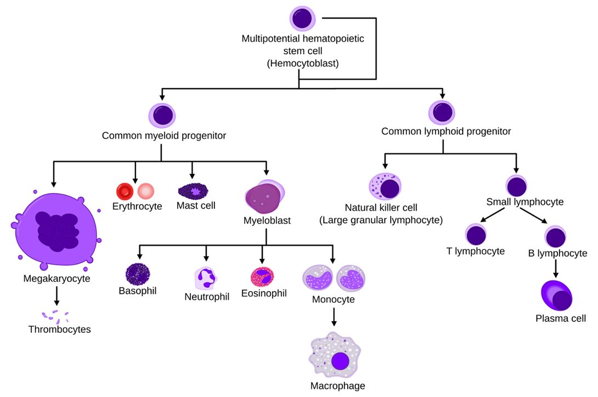

# Blood
- ### 血小板
- ### Red blood cell
- ### Leukocyte (White Blood Cell)
    - #### Dendritic Cell (DC)
- ### 纖維蛋白

# Hematopoietic Stem Cells (HSCs)

- ### Myeloid
- ### Lymphoid

# Coagulation (Clotting)
- ### 凝血因子
- ### 血塊
- ### 血栓
    - #### 動脈血栓
    - #### 靜脈血栓
        - 深部靜脈血栓
- ### 血痂

# Embolus and Embolism
- ### Embolus (栓子)：卡在血管的異物
- ### Embolism (栓塞)：血管內的異物卡在血管，造成血流阻塞
    - #### 肺栓塞
- ### 栓子的種類
    - #### 血栓栓塞
    - #### 脂肪栓塞
    - #### 空氣栓塞
    - #### 羊水栓塞
- ### 

# Hematologic Disease
- ### [Hematologic Disease](./hematologic-disease/hematologic-disease.md)

