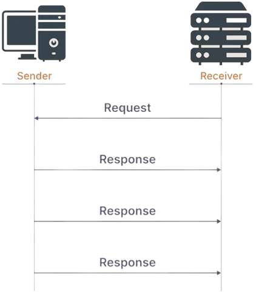

# Application layer
- ### HyperText Transfer Protocol(HTTP)
- ### HTTP Secure(HTTPS)
- ### Domain Name System(DNS)
- ### Secure Shell(SSH)
- ### File Transfer Protocol(FTP)
- ### Simple Mail Transfer Protocol(SMTP)：email
- ### Multipurpose Internet Mail Extensions(MIME)
- ### Telnet：Remote login to hosts
- ### remote desktop

# Transport layer
- ### TCP、UDP
    ||Transmission Control Protocol(TCP)|User Datagram Protocol(UDP)|
    |:---:|:---:|:---:|
    ||||
    |Connection|Connection-Oriented|Connectionless|
    |Speed|slow|fast|
    |Reliability|reliable|unreliable|
    |Handshake|three-way handshake|no handshake|
    |eg|email、web、file transfer|Real-time applications streaming media、game、Voice over IP(VoIP)|
- ### Transport Layer Security(TLS)
- ### Datagram Congestion Control Protocol(DCCP)
- ### Point to Point Tunneling Protocol(PPTP)