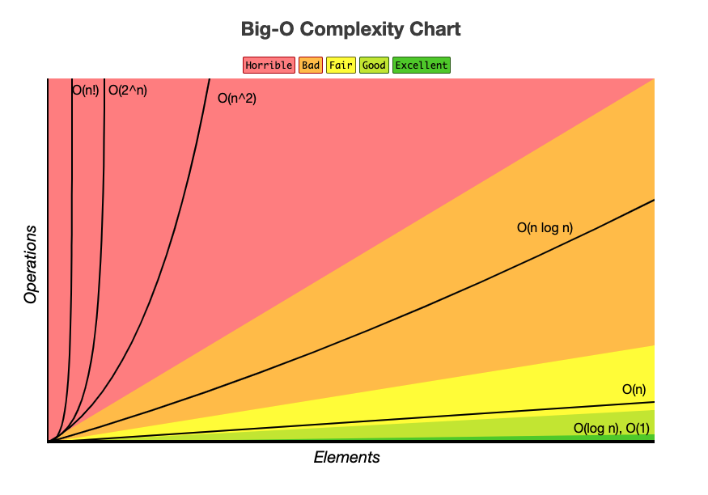

# Time Complexity
- ### Notation
    |Big O Notation|Big Ω Notation|Big Θ Notation|
    |:---:|:---:|:---:|
    |$`O()`$|$`Ω()`$|$`Θ()`$|
    |Worst-case Time Complexity (Upper Bound)|Best-case Time Complexity (Lower Bound)|Average-case Time Complexity|
    - ### Strict Bounds
        |Little o Notation|Little ω Notation|
        |:---:|:---:|
        |$`o()`$|$`ω()`$|
        |Worst-case Time Complexity (Strict Upper Bound)|Best-case Time Complexity (Strict Lower Bound)|
- ### Time Complexity = the dominant term of $`T(n)`$ ignoring coefficients
    - $`T(n)`$ = number of operations
- #### eg
    - number of operations = $`T(n)=2n^2+n+1`$
    - Time Complexity = $`O(n^2)`$
- ### Common Time Complexities
    

    |Time Complexity|$`O()`$ ($`a>1,~b>1`$)|Name|eg|
    |:---:|:---:|:---:|:---:|
    |Faster|$`O(1)`$|Constant time||
    |$\downarrow$|$`O(\log_a{n})`$|Logarithmic time|[Binary search]()|
    |$\downarrow$|$`O((\log_a{n})^b)`$|Polylogarithmic time|||
    |$\downarrow$|$`O(n)`$|Linear time|[Linear search]()|
    |$\downarrow$|$`O(n\log_a{n})`$|Linearithmic time|[Merge sort]()|
    |$\downarrow$|$`O(n^2)`$|Quadratic time|[Bubble sort](), [Insertion sort](), [Selection sort]()|
    |$\downarrow$|$`O(n^a)`$|Polynomial time (P)|[Matrix multiplication]()|
    |$\downarrow$|$`O(a^n)`$|Exponential time||
    |Slower|$`O(n!)`$|Factorial time||

# Space Complexity

# Computational Complexity Theory

- ### Nondeterministic Polynomial Time (NP)
- ### Polynomial Time (P)
    - $`\text{P} \subseteq \text{NP}`$
- ### NP-Hard
- ### NP-Complete
    - $`\text{NP-Complete}=\text{NP}\cap \text{NP-Hard}`$

# Master Theorem
- ### Master Theorem：$`T(n)=aT(\frac{n}{b})+f(n)`$

# Amortized Analysis
