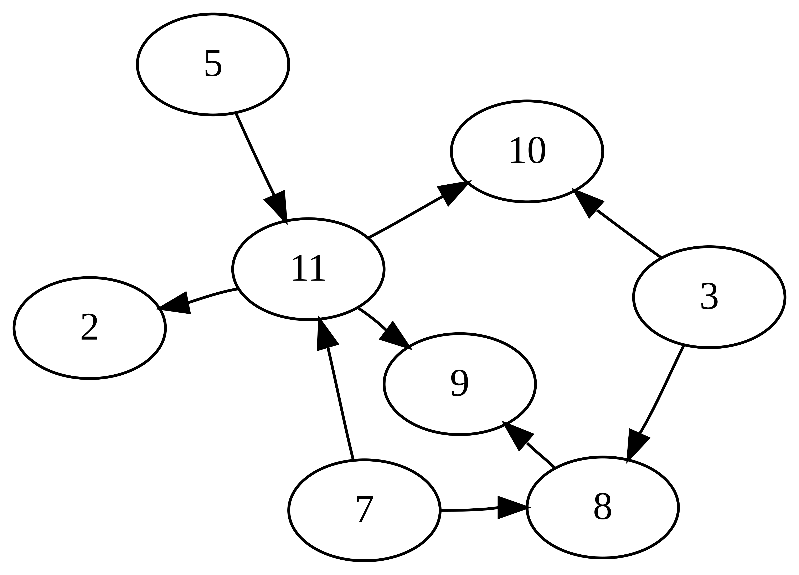

# Graph Data Structure
- ### Undirected Graph
 
- ### Directed Graph

    - ### [Tree Data Structure](./tree/tree.md)
    - ### Directed Acyclic Graph (DAG)
        
- ### [Regular Graph](#regular-graph-1)
    - ### Complete Graph
- ### Weighted Graph：edges have edge weight
 

# Regular Graph
- ### Regular Graph(undirected)：every vertex has the same degree

- ### Regular Graph(directed)：every vertex has the same indegree and outdegree
- ### K-Regular Graph：(degree=k)的Regular Graph
- ### Complete Graph：每一對vertices都由一個edge相連
 

# Elements of Graph
- ### `G(V,E)`
- ### Vertex
- ### Edge
    - ### Multiple Edges
    
    - ### Cycle
    
    - ### Loop
 
- ### Edge Weight
- ### Neighbor
- ### Degree：與該vertex相連的Edge的數量
    - ### indegree(directed)：進入該vertex的Edge的數量
    - ### outdegree(directed)：從該vertex的Edge的數量
- ### Complement Graph
- ### Isomorphism

# Graph Representation
- ### Adjacency Matrix
- ### Adjacency List
- ### Adjacency Multilist
- ### Index Table

# Graph Algorithms
- ### [Graph Traversal](./graph-algorithms/graph-traversal.md)
- ### [Shortest Path Algorithm](./graph-algorithms/shortest-path-algorithm.md)
- ### [Topological Sort](./graph-algorithms/topological-sort.md)
- ### [Tree Algorithm](./tree/tree.md#tree-algorithm)

# Graph Problems
- ### [Eulerian Graph](./graph-problems/eulerian-graph.md)
- ### [Hamiltonian Graph](./graph-problems/hamiltonian-graph.md)
- ### [Graph Coloring Problem](./graph-problems/graph-coloring-problem.md)
- ### [Travelling Salesman Problem (TSP)](../../algorithm/combinatorial-optimization.md#travelling-salesman-problem-tsp)