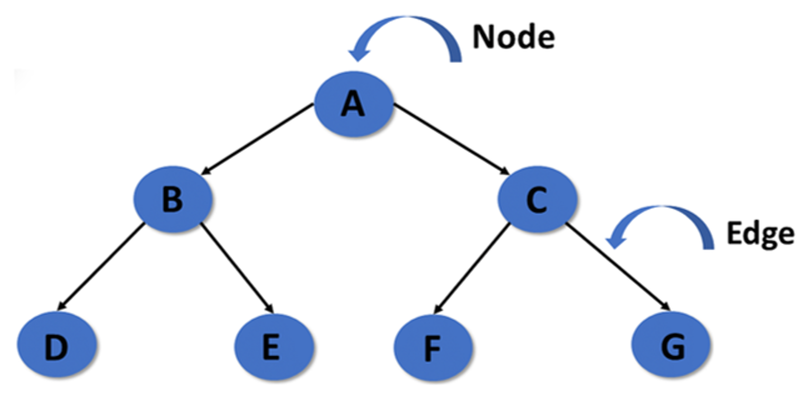
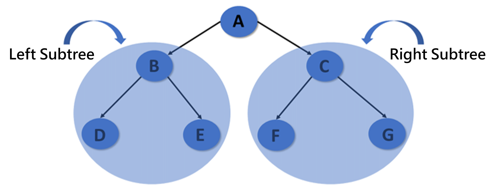
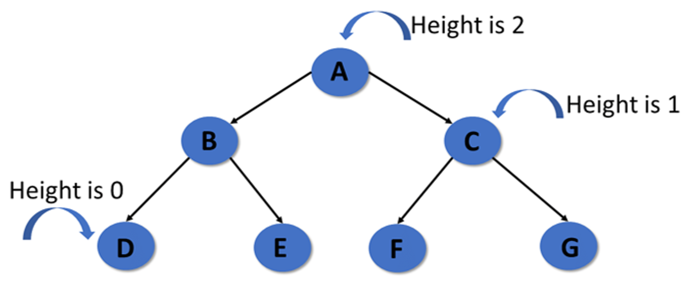
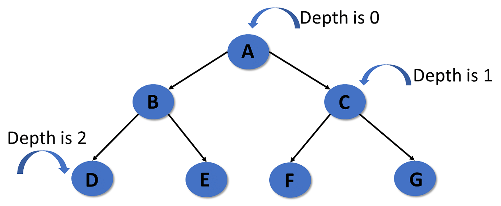
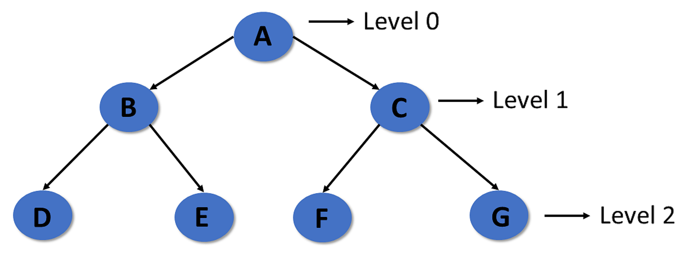

# Tree Data Structure
- ### General Tree
- ### [Binary Tree](binary-tree.md)
- ### K-Dimensional Tree(K-D Tree)
- ### B+ Tree
- ### [Spanning Tree](spanning-tree.md)
- ### Abstract Syntax Tree(AST)
- ### Decision Tree
    - ### Game Tree
- ### Disjoint Set

# Elements of Tree

- ### Node
    |Node|Definition|Example|
    |:---:|:---:|:---:|
    |Root Node|the topmost node|A
    |Leaf Node|the bottommost nodes|D, E, F, G|
    |Parent Node|a node that has one or more child nodes connected below it|B is the parent node of D|
    |Child Node|a node connected directly below a parent node|D is the child node of B|
    |Left Child Node|a child node positioned on the left side of its parent node|D is the left child node of B|
    |Right Child Node|a child node positioned on the right side of its parent node|E is the right child node of B|
    |Ancestor Node|any node located on the upward path from a given node|A and B are the ancestor nodes of D|
    |Descendant Node|any node that can be reached by moving downward from a given node|B and D are the descendant nodes of A|
    |Sibling Node|nodes that share the same parent node|D, E|
- ### Edge
- ### Subtree
    

    |Subtree|Definition|
    |:---:|:---:|
    |Subtree|a smaller tree consisting of a given node and all of its descendants|
    |Left Subtree|a subtree rooted at the left child node of a parent node|
    |Right Subtree|a subtree rooted at the right child node of a parent node|

# Height and Depth
|Name|Definition|Example|
|:---:|:---:|:---:|
|Height|the number of edges on the longest path from the given node down to a leaf node||
|Depth|the number of edges on the path from the root node down to the given node||
|Level|the number of edges on the path from the root node down to the given node||

# Tree Algorithms
- ### [DP](../../../algorithm/dynamic-programming.md) on Tree
- ### Centroid Decomposition
- ### Lowest Common Ancestor (LCA)
- ### Binary Lifting
- ### Heavy-Light Decomposition
 

