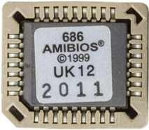

# Memory Hierarchy

- ### Register
- ### Cache (L1 Cache → L2 Cache → L3 Cache → L4 Cache)
    - #### [SRAM](volatile-memory.md#static-ram-sram)：L1 Cache, L2 Cache, L3 Cache
    - #### [DRAM](volatile-memory.md#dynamic-ram-dram)：L4 Cache
- ### Main Memory
    - #### [DRAM](volatile-memory.md#dynamic-ram-dram)
    - #### [SRAM](volatile-memory.md#static-ram-sram)
    - #### [ROM](non-volatile-memory.md#read-only-memory-rom)
        - run BIOS
            
            
- ### Disk Storage
    - #### [SSD](non-volatile-memory.md#solid-state-drive-ssd)
    - #### [HDD](non-volatile-memory.md#hard-disk-drive-hdd)
    - #### [Floppy Disk](non-volatile-memory.md#floppy-disk)
    - #### [Optical Disc](non-volatile-memory.md#optical-disc)

# Memory Access Methods
- ### Random Access
    - #### Random Access Memory (RAM)
        - [Volatile RAM](volatile-memory.md#volatile-ram)
        - [Non-Volatile RAM (NVRAM)](non-volatile-memory.md#non-volatile-ram-nvram)
- ### Sequential Access
    - #### Sequential Access Memory (SAM)

# Register
- ### Program Counter (PC)：holds the address of the next instruction that would be executed
- ### Instruction Register (IR)：holds the instruction that is being executed
- ### Data Register (DR)
- ### Accumulator：holds the data and results of operations

# Volatile, Non-Volatile
- ### [Volatile Memory](volatile-memory.md)
- ### [Non-Volatile Memory (NVM)](non-volatile-memory.md)

