# Non-Volatile RAM (NVRAM)
- ### Resistive RAM (RRAM)

# Read Only Memory (ROM)
- ### Programmable ROM (PROM)
    - #### Erasable PROM (EPROM)
        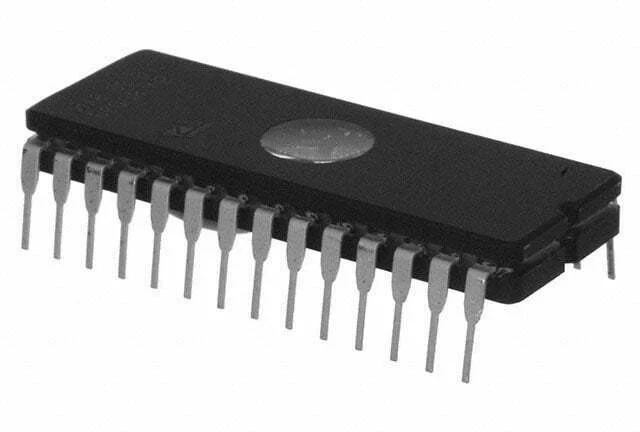
    - #### Electrically-Erasable PROM (EEPROM)
        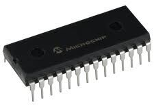
- ### Flash Memory
    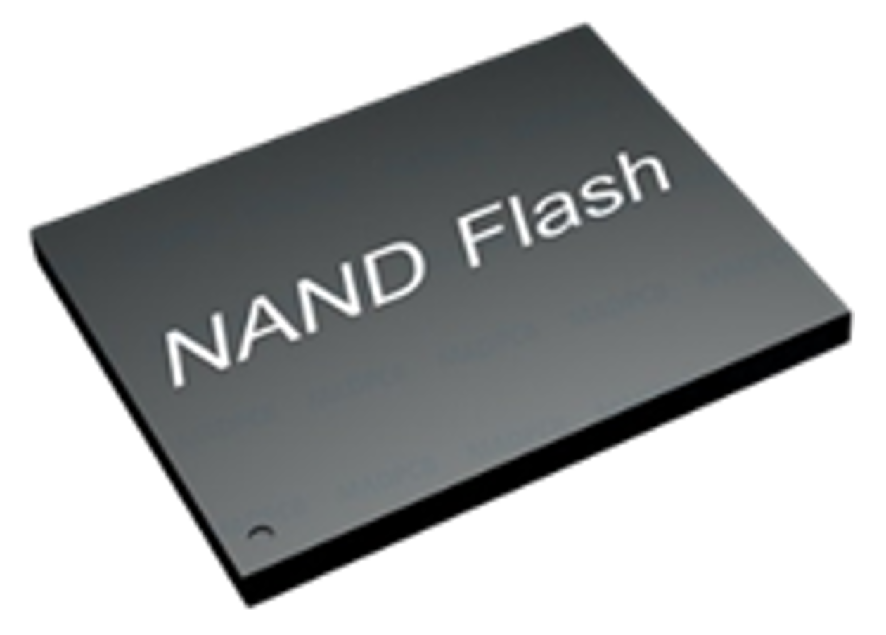
    
    - #### USB Flash Drive
        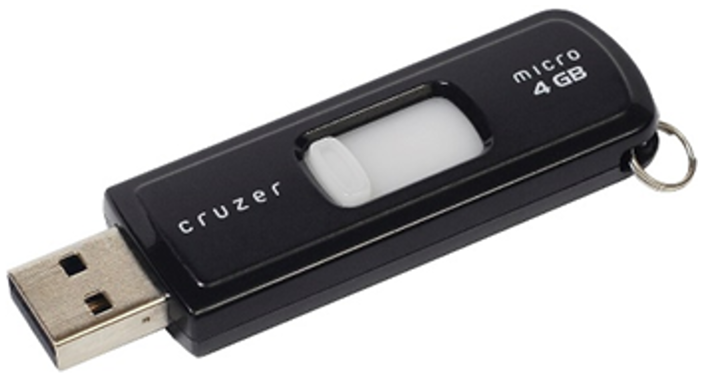

# Solid-State Drive (SSD)

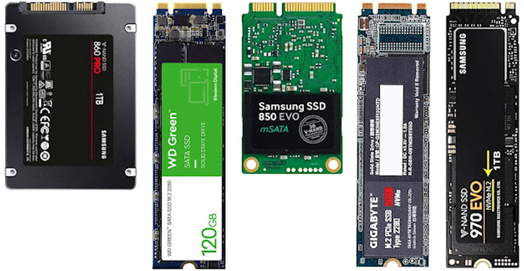

# Magnetic Storage
- ### Hard Disk Drive (HDD)
    - #### ATA HDD
    - #### SATA HDD
        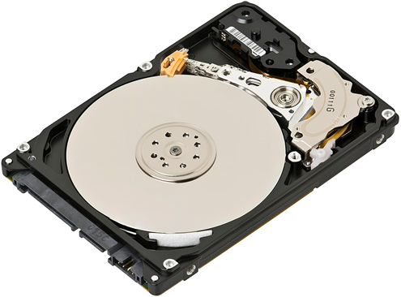
    - #### SCSI HDD
    - #### SAS HDD
    - #### FC HDD
- ### Floppy Disk
    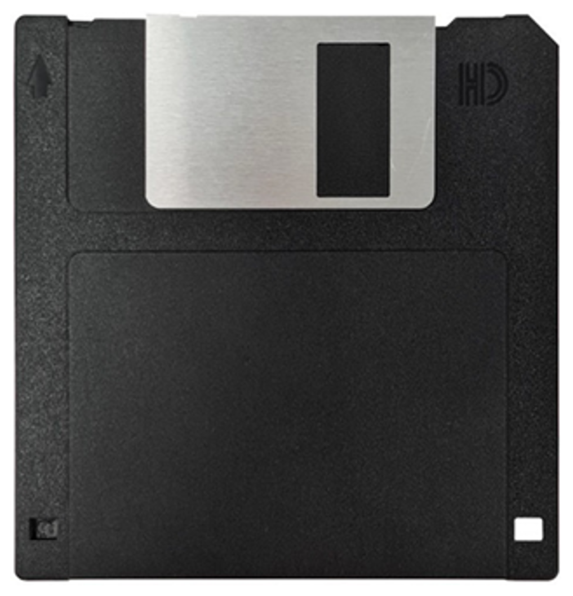
- ### Magnetic Tape
    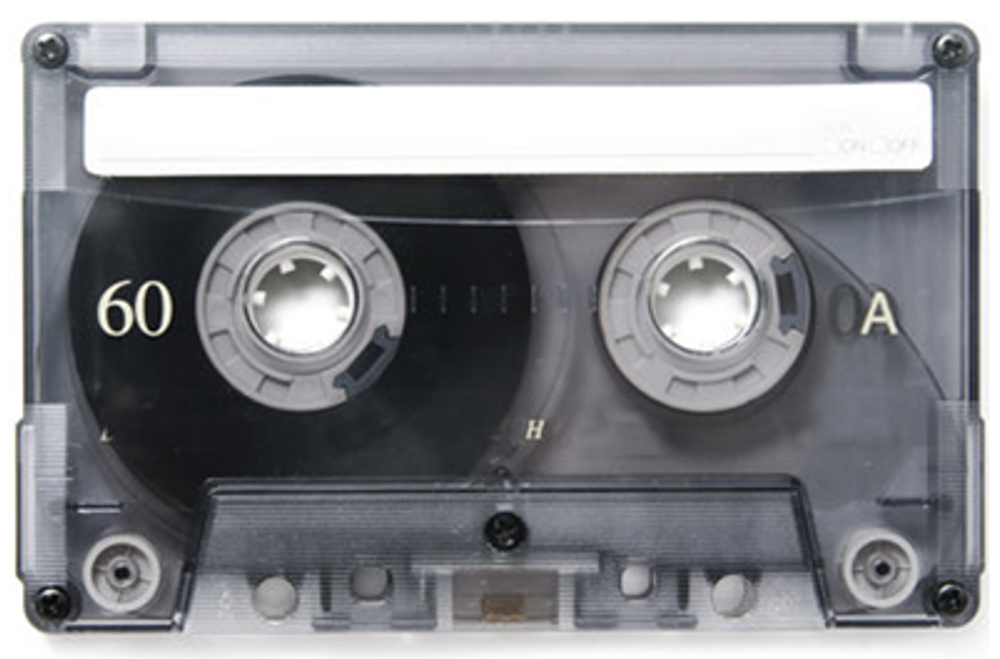

# Optical Disc
- ### Compact Disc (CD)
    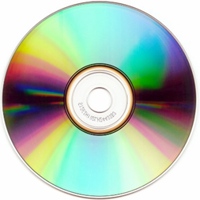

    - #### CD-[ROM](#read-only-memory-rom)
- ### Digital Versatile Disc (DVD)
    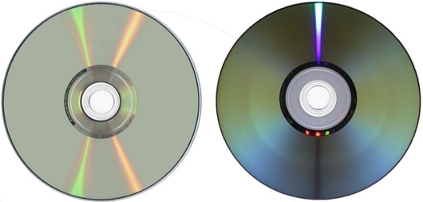
- ### Blu-ray Disc (BD)
    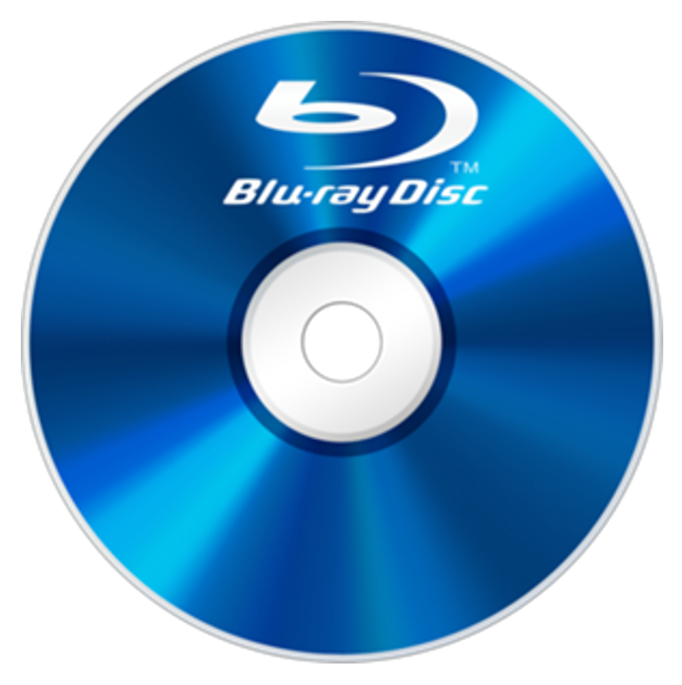

# 3D XPoint
