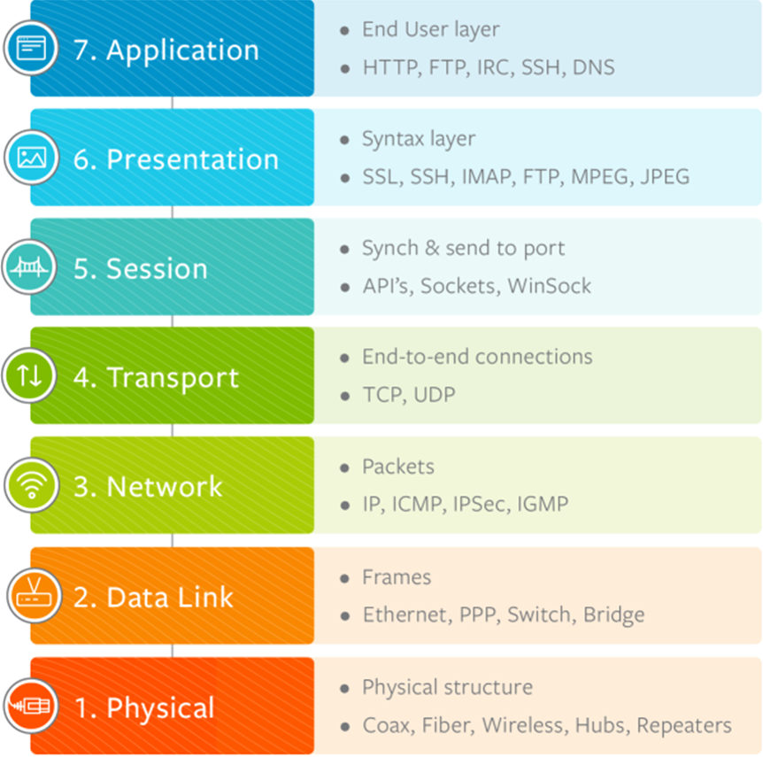

# Communication Protocol
- ### Open Protocol
    - ### Open System Interconnection model(OSI model)
        

        - hint：A Pretty Sexy Teacher Never Dates Physicists
    - ### TCP/IP Protocol Suite(DoD model)
        
- ### Proprietary Protocol

# Protocol stack

    

# Protocol Layer
- ### [Protocol Layer](./protocol-layer/protocol-layer.md)

# ARPANET
