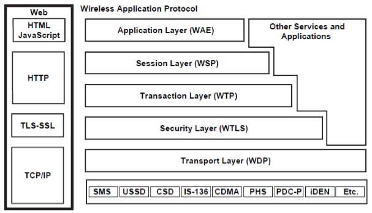
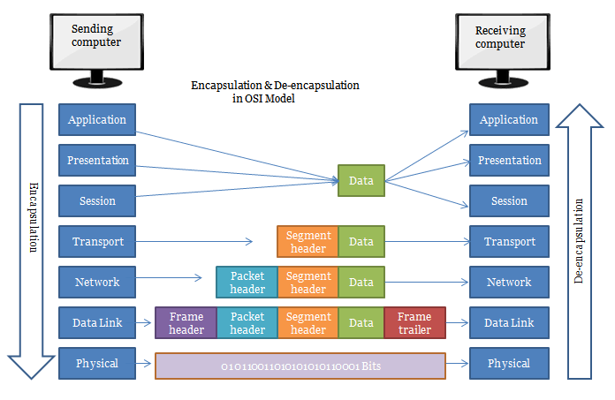
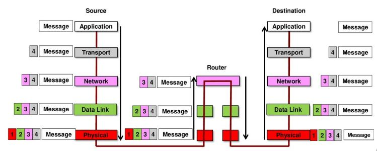
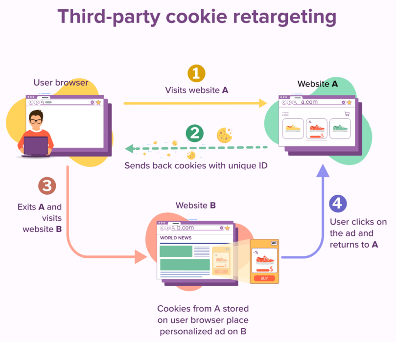

# Communication Protocol
- ### [Types of Communication Protocol](#types-of-communication-protocol-1)
- ### [Protocol Stack (Protocol Suite)](#protocol-stack-protocol-suite-1)
    - ### [Protocol Layer](./protocol-layer/protocol-layer.md)
- ### [Encapsulation](#encapsulation-1)

# Types of Communication Protocol
- ### Open Protocol, Proprietary Protocol
    - ### Open Protocol
        - [OSI model](#open-system-interconnection-model-osi-model)
        - [TCP/IP Protocol Suite](#tcpip-protocol-suite-internet-protocol-suite-dod-model)
        - [Wireless Application Protocol Stack](#wireless-application-protocol-stack-wap-stack)
    - ### Proprietary Protocol
        - eg：Skype protocol, PlayStation Network(PSN), Nintendo Wi-Fi Connection(Nintendo WFC)
- ### Stateful Protocol, Stateless Protocol
    ||Stateful Protocol|Stateless Protocol
    |:---:|:---:|:---:|
    |**Session**|Stored by Server|Not stored by Server (Stored by Client)|
    |**Resource usage**|High|Low|
    |**Fault Tolerance**|Low|High|
    |**Scalability**|Difficult|Easy|
    |**eg**|[FTP](./protocol-layer/protocol-layer.md#file-transfer-protocol-ftp), [SSH](./protocol-layer/protocol-layer.md#secure-shell-ssh), [TCP](./protocol-layer/transport-layer/tcp.md)|[HTTP](./protocol-layer/application-layer/http.md), [DNS](./protocol-layer/application-layer/dns.md), [UDP](./protocol-layer/transport-layer/udp.md), [IP](./protocol-layer/network-layer/ip.md)|

# Protocol Stack (Protocol Suite)

- ### Open System Interconnection model (OSI model)
    

    - Mnemonic：A Pretty Sexy Teacher Never Dates Physicists (APSTNDP)
- ### TCP/IP Protocol Suite (Internet Protocol Suite, DoD model)
    
- ### Wireless Application Protocol Stack (WAP Stack)
    

    - Wireless Application Environment (WAE)
    - Wireless Session Protocol (WSP)
    - Wireless Transaction Protocol (WTP)
    - Wireless Transport Layer Security (WTLS)
    - Wireless Datagram Protocol (WDP)

# Encapsulation
- ### [Packet](../packet.md)：Encapsulation → Transmission → Decapsulation
    

    - ### Encapsulation：Add Header to Packet
    - ### Decapsulation：Remove Header from Packet
- ### Encapsulation of [Intermediary Network Devices](../networking-hardware.md)
    

# Web Tracking
- ### Methods
    - #### [HTTP Cookie](./protocol-layer/application-layer/http.md#http-cookie-cookie)
    - #### [HTTP ETag](./protocol-layer/application-layer/http.md#http-etag)
    - #### [IP Address](./protocol-layer/network-layer/ip.md#ip-address)
- ### Browser Fingerprinting
    - #### Canvas Fingerprinting
- ### Web Beacon
- ### Retargeting
    
