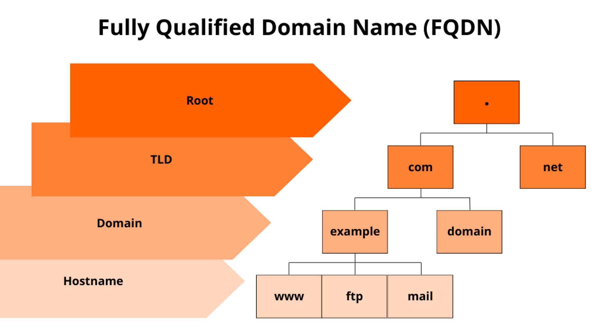

# Fully Qualified Domain Name (FQDN)
- ### \<[Hostname](#hostname)>.\<[Domain Name](#domain-name-domain)>.\<[TLD](#top-level-domain-tld)>
    
- ### eg：www.google.com、suichan.servegame.com

# Hostname
|Hostname|Entity|
|:---:|:---:|
|www|World Wide Web|
|localhost|Local Computer|

# Domain Name (Domain)
- ### Internationalized Domain Name (IDN)
- ### Cybersquatting (Domain squatting)

# Top-level Domain (TLD)
- ### Generic TLD (gTLD)
    |gTLD|Entity|
    |:---:|:---:|
    |.com|Company|
    |.net|Network|
    |.org|Organization|
    |.info|Information|
    |.biz|Business|
    |.pro|Professional|
    |.name|Name|
- ### Sponsored TLD (sTLD)
    |sTLD|Entity|
    |:---:|:---:|
    |.edu|Education|
    |.gov|Government|
    |.mil|Military|
    |.asia|Asia|
    |.xxx|Internet Pornography|
- ### Country Code TLD (ccTLD)
    |ccTLD|Entity|
    |:---:|:---:|
    |.us|United States|
    |.uk|United Kingdom|
    |.eu|European Union|
    |.jp|Japan|
    |.tw|Taiwan|
