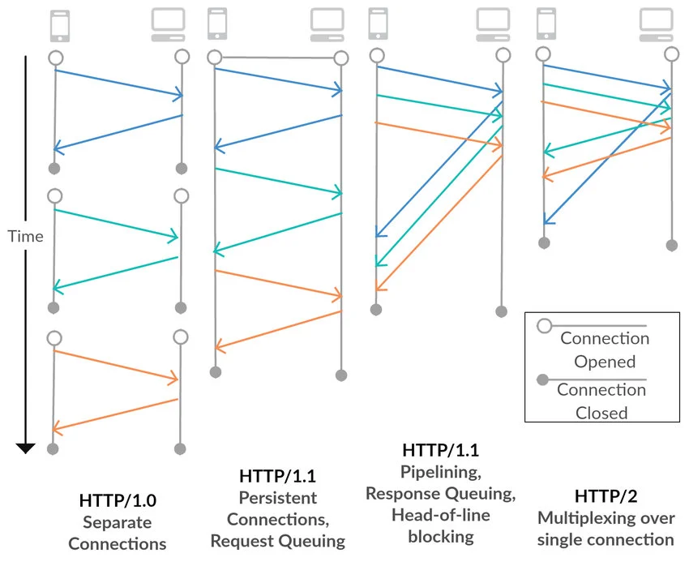

# HTTP Version
- ### HTTP/1.0
- ### HTTP/1.1
- ### HTTP/2
- ### HTTP/3

# HTTP Non-persistent/Persistent Connection

- ### HTTP Non-persistent Connection
    1. TCP connection opened
    2. send and receive Single HTTP request/response
    3. TCP connection closed
- ### HTTP Persistent Connection
    1. TCP connection opened
    2. send and receive Multiple HTTP requests/responses
    3. TCP connection closed

# HTTP Message Format
- ### HTTP Request Message：[Request line](#request-linehttp-method--uri--http-version) + [Request Headers](#request-headers) + Body
    - ### Request line：[HTTP Method](#http-method) + [URI](../../computer-networking.md#uniform-resource-identifier-uri) + [HTTP Version](#http-version)
- ### HTTP Response Message：[Status line](#status-linehttp-version--http-status-code) + [Response Headers](#response-headers) + Body
    - ### Status line：[HTTP Version](#http-version) + [HTTP Status Code](#http-status-code)

# HTTP Method
- ### GET
- ### HEAD
- ### POST
- ### PUT
- ### DELETE
- ### CONNECT
- ### OPTIONS
- ### TRACE
- ### PATCH

# HTTP Status Code
- ### 1xx Informational Response
  - 100 Continue
  - 101 Switching Protocols
- ### 2xx Success
    - 200 OK
    - 201 Created
    - 202 Accepted
    - 204 No Content
- ### 3xx Redirection
    - 304 Not Modified
- ### 4xx Client Error
    - 403 Forbidden
    - 404 Not Found
    - 405 Method Not Allowed
    - 406 Not Acceptable
- ### 5xx Server Error

# HTTP Headers
- ### Request Headers
    - Host
    - User-Agent
    - Accept
    - Accept-Language
    - Accept-Encoding
    - Referer
    - Connection
    - Content-Length
    
- ### Response Headers
    - Connection
    - Content-Encoding
    - Content-Language
    - Content-Length
    - Content-Type
    - Date
    - ETag
    - Keep-Alive
    - Last-Modified
    - Server
    - Set-Cookie
    

