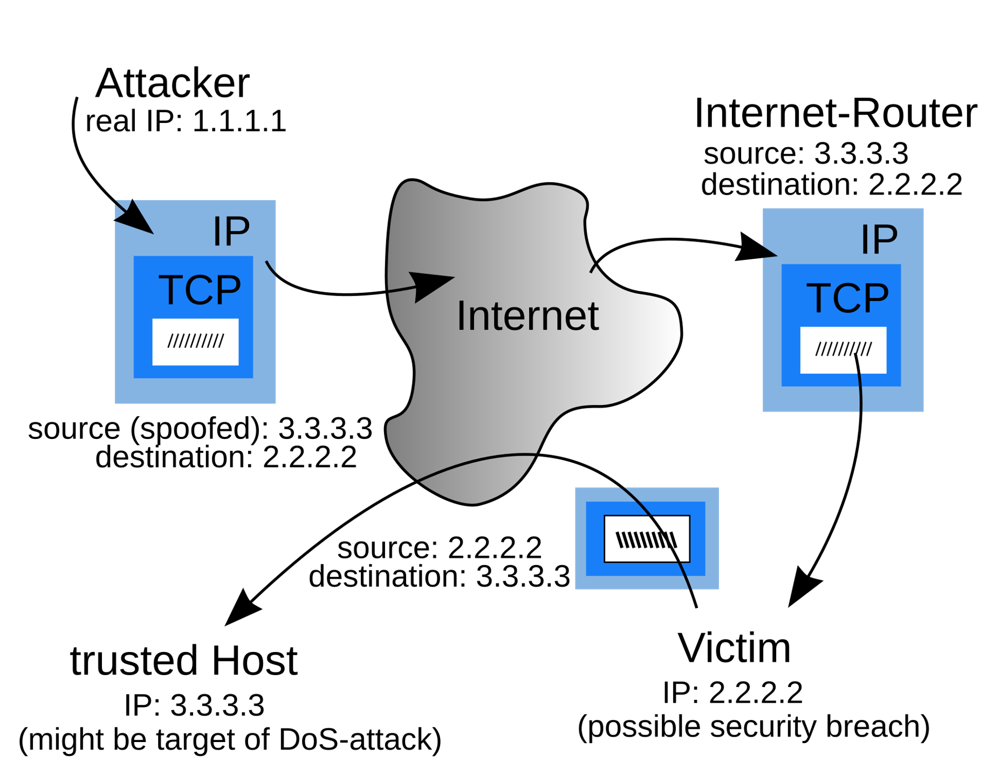

# IP Address
- ### IP Address＝[Network address](#network-address)＋[Host address](#host-address)
    - ###   IPv4 Address
        
    - ### IPv6 Address
        
- ### [IP Address Components](#ip-address-components-1)
- ### IP Address Spoofing
    

# IP Address Components
- ### Network address
- ### Host address

# Subnetwork
- ### Subnet Mask
- ### Classless Inter-Domain Routing (CIDR)

# Voice over Internet Protocol (VoIP)

