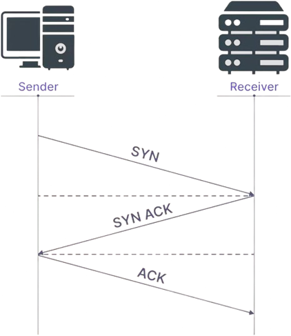
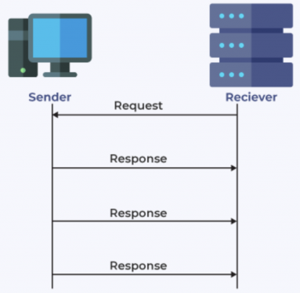
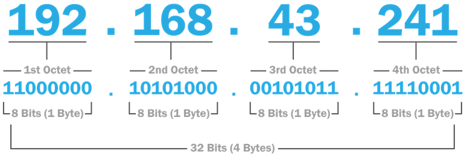
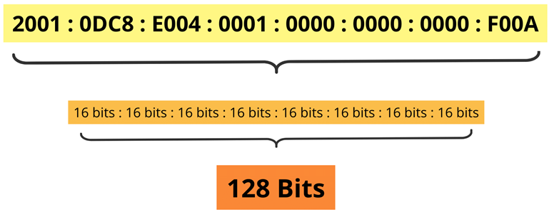

# Application layer
- ### HyperText Transfer Protocol(HTTP)
- ### HTTP Secure(HTTPS)
- ### Domain Name System(DNS)
- ### Secure Shell(SSH)
- ### File Transfer Protocol(FTP)
- ### Simple Mail Transfer Protocol(SMTP)：email
- ### Multipurpose Internet Mail Extensions(MIME)
- ### Telnet：Remote login to hosts
- ### remote desktop

# Transport layer
- ### TCP、UDP
    ||Transmission Control Protocol(TCP)|User Datagram Protocol(UDP)|
    |:---:|:---:|:---:|
    |Communication|||
    |Connection|Connection-Oriented|Connectionless|
    |Speed|slow|fast|
    |Reliability|reliable|unreliable|
    |Handshake|three-way handshake|no handshake|
    |eg|email、web、file transfer|Real-time applications streaming media、game、Voice over IP(VoIP)|
- ### Transport Layer Security(TLS)
- ### Datagram Congestion Control Protocol(DCCP)
- ### Point to Point Tunneling Protocol(PPTP)

# Network layer
- ### Internet Protocol(IP)
    - #### IPv4
    - #### IPv6
- ### Route
    - #### Routing
    - #### Router
    - #### Traceroute(tracert)
        
    - #### Routing Protocol
        - #### Routing Information Protocol(RIP)
        - #### Open Shortest Path First(OSPF)
- ### Gateway
- ### Internet Control Message Protocol(ICMP)

# Data link layer
- ### Wi-Fi
- ### Ethernet
- ### Switch
- ### Point-to-Point Protocol(PPP)
- ### Asynchronous Transfer Mode(ATM)

# Physical layer
- #### Electrical cable
- #### Optical fiber
- #### Modem

# IP address
- ### IP address＝Network address＋Host address
- ### IP address
    - #### IPv4 address
        
    - #### IPv6 address
        
- ### Network address
- ### Host address
- ### Subnetwork
    - #### Subnet Mask
- ### Classless Inter-Domain Routing(CIDR)

# Domain Name System(DNS)
- ### Fully Qualified Domain Name(FQDN)
    - #### Hostname.Domain Name.TLD
    - #### eg：suichan.servegame.com
- ### Hostname
- ### Domain Name(Domain)
    - #### Internationalized Domain Name(IDN)
    - #### Cybersquatting(Domain squatting)
- ### Top-level Domain(TLD)
    - #### generic TLD(gTLD)
        - .com(company)
        - .net
        - .org(organization)
        - .info(information)
        - .biz(business)
        - .pro(professional)
        - .name
    - #### Sponsored TLD(sTLD)
        - .edu(education)
        - .gov(government)
        - .mil(military)
        - .asia
        - .xxx
    - #### country code TLD(ccTLD)
        - .us(united states)
        - .uk(united kingdom)
        - .eu(european union)
        - .jp(japan)
        - .tw(taiwan)

