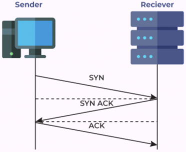

# Application layer
- ### HTTP/HTTPS
    - ### [HyperText Transfer Protocol (HTTP)](http.md)
    - ### HTTP Secure (HTTPS) = [HTTP](http.md) + [TLS/SSL](#tlsssl)
- ### [Domain Name System (DNS)](dns.md)
- ### Secure Shell (SSH)
- ### File Transfer Protocol (FTP)
    - ### FTP Secure (FTPS) = [FTP](#file-transfer-protocol-ftp) + [TLS/SSL](#tlsssl)
- ### Simple Mail Transfer Protocol (SMTP)：email
- ### Multipurpose Internet Mail Extensions (MIME)
    - #### [MIME Type (Media Type)](../../computer-networking.md#mime-typemedia-type)
- ### Telnet：Remote login to hosts
- ### Remote Desktop

# Transport layer
- ### TCP/UDP
    ||Transmission Control Protocol (TCP)|User Datagram Protocol (UDP)|
    |:---:|:---:|:---:|
    |**Communication**|||
    |**Connection**|Connection-Oriented|Connectionless|
    |**Speed**|Slow|Fast|
    |**Reliability**|Reliable|Unreliable|
    |**Handshake**|Three-way Handshake|No Handshake|
    |**Application**|email, web, file transfer|Real-time applications (streaming media, game, [VoIP](ip.md#voice-over-internet-protocolvoip))|
- ### Datagram Congestion Control Protocol (DCCP)
- ### Point to Point Tunneling Protocol (PPTP)

# Network layer
- ### [Internet Protocol (IP)](ip.md)
    - #### [IPv4](ip.md#ipv4-address)
    - #### [IPv6](ip.md#ipv6-address)
- ### [Routing](../../routing.md)
- ### [Gateway](../../networking-hardware.md#gateway)
- ### Internet Control Message Protocol (ICMP)

# Data link layer
- ### Wi-Fi
- ### Ethernet
- ### [Switch](../../networking-hardware.md#switch)
- ### Point-to-Point Protocol (PPP)
- ### Asynchronous Transfer Mode (ATM)

# Physical layer
- ### [Modem](../../networking-hardware.md#modulator-demodulator-modem)
- ### [Transmission Medium](../../networking-hardware.md#transmission-medium)

# Others
- ### TLS/SSL
    - #### Evolution：Secure Sockets Layer (SSL) → Transport Layer Security (TLS)
    - #### Layer：[Transport layer](#transport-layer) < TLS/SSL < [Application layer](#application-layer)
    - #### Workflow：TCP Three-way Handshake → TLS Handshake → Encrypted Data Transfer
- ### Automatic Repeat-reQuest(ARQ)
    - #### Layer：[Data link layer](#data-link-layer), [Transport layer](#transport-layer)
    - #### Stop-and-Wait ARQ
    - #### Go-Back-N ARQ
    - #### Selective Repeat ARQ

