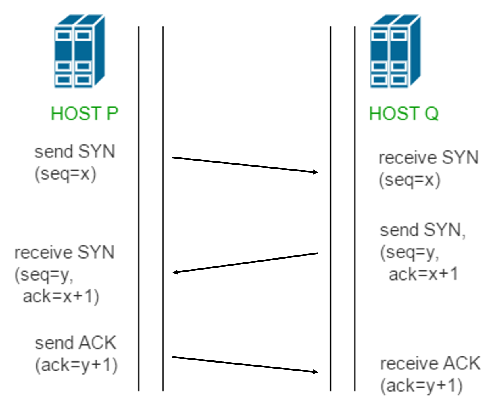

# TCP Header Format

# Three-way [Handshake](../../../packet.md#handshake)

- ### $`\text{SYN} \left(seq=x\right) \to \text{SYN ACK} \left(seq=y,~ack=x+1\right) \to \text{ACK} \left(ack=y+1\right)`$

# TCP Congestion Control
- ### Slow Start
    - ### Slow Start Threshold (ssthresh)
- ### Fast Retransmit
- ### Fast Recovery
- ### congestion window (cwnd)
- ### Additive Increase Multiplicative Decrease (AIMD)
- ### Congestion Control Algorithms
    - ### TCP Tahoe and Reno
        - TCP Tahoe
        - TCP Reno
    - ### TCP Bottleneck Bandwidth and Round-trip propagation time (TCP BBR)
    - ### TCP Vegas
    - ### TCP CUBIC

# TCP Flow Control

