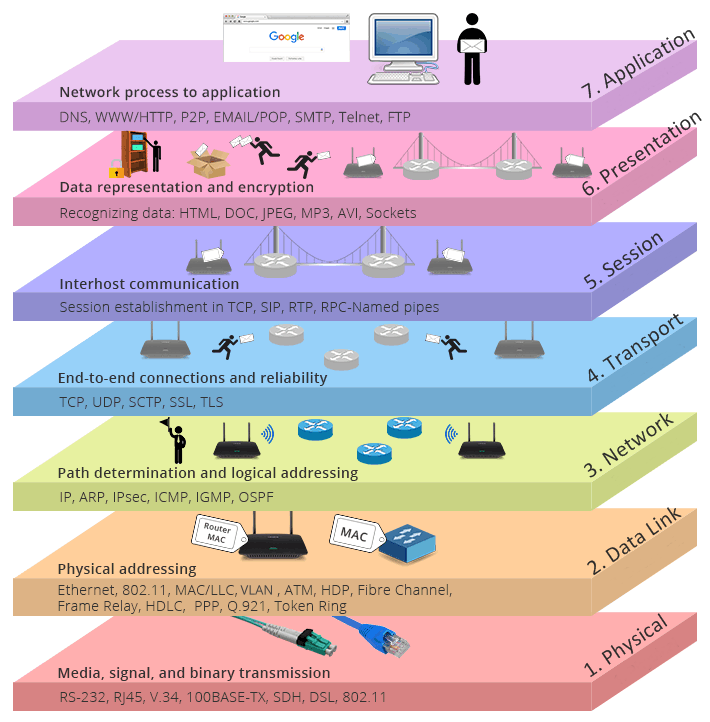
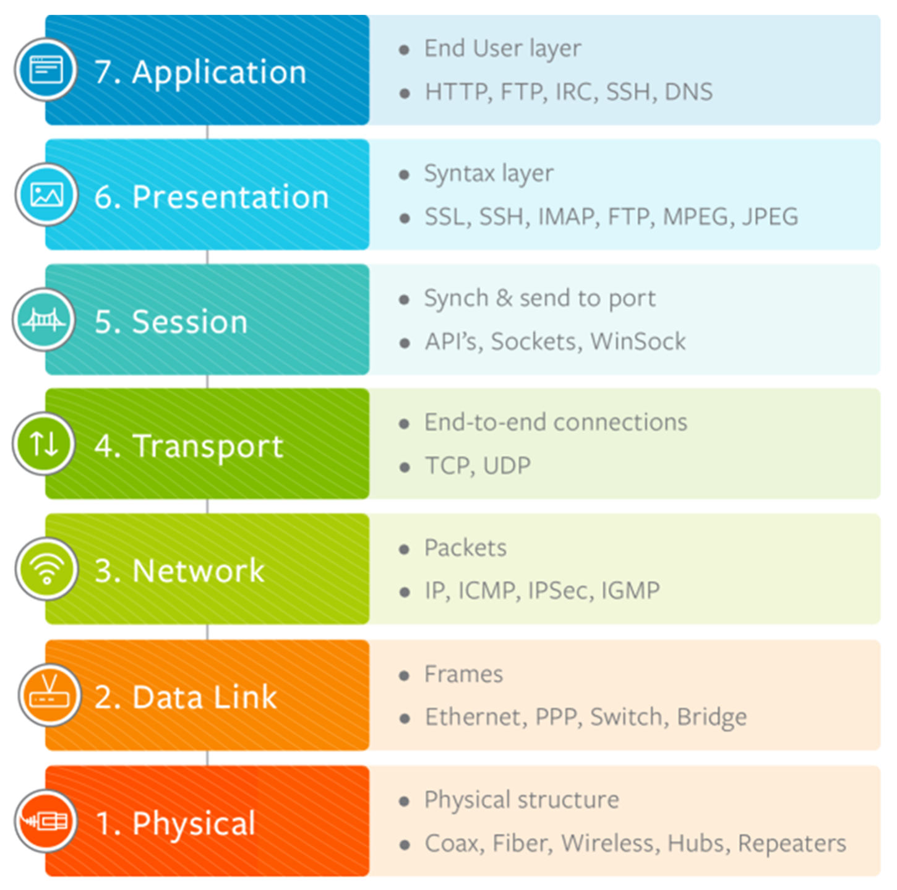
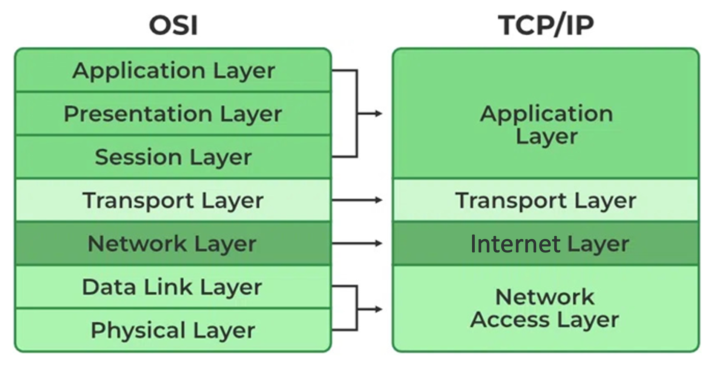
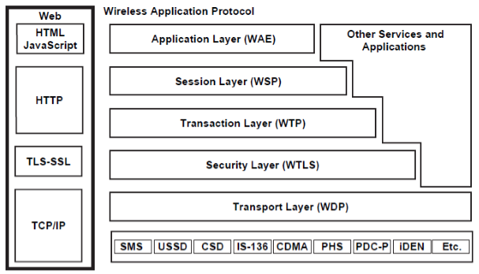

# Protocol Stack (Protocol Suite)

- ### [Protocol Layer](./protocol-layer/protocol-layer.md)

# Open System Interconnection model (OSI model)

- ### Layers
    - #### [Application layer](./protocol-layer/protocol-layer.md#application-layer)
    - #### Presentation layer
    - #### Session layer
    - #### [Transport layer](./protocol-layer/protocol-layer.md#transport-layer)
    - #### [Network layer](./protocol-layer/protocol-layer.md)
    - #### [Data Link layer](./protocol-layer/protocol-layer.md#data-link-layer)
    - #### [Physical layer](./protocol-layer/protocol-layer.md#physical-layer)
- ### Mnemonic：A Pretty Sexy Teacher Never Dates Physicists (APSTNDP)

# TCP/IP Protocol Suite (Internet Protocol Suite, DoD model)

- ### Layers
    - #### [Application layer](./protocol-layer/protocol-layer.md#application-layer)
    - #### [Transport layer](./protocol-layer/protocol-layer.md#transport-layer)
    - #### Internet layer = [Network layer](./protocol-layer/protocol-layer.md)
    - #### Network Access layer = [Data Link layer](./protocol-layer/protocol-layer.md#data-link-layer) + [Physical layer](./protocol-layer/protocol-layer.md#physical-layer)

# [Internet Protocol Security (IPsec)](./tunneling/tunneling-protocol/ipsec/ipsec.md)
- ### [IPsec VPN](./tunneling/tunneling-protocol/ipsec/ipsec-vpn.md)

# Wireless Application Protocol Stack (WAP Stack)

- ### Layers
    - #### Wireless Application Environment (WAE)
    - #### Wireless Session Protocol (WSP)
    - #### Wireless Transaction Protocol (WTP)
    - #### Wireless Transport Layer Security (WTLS)
    - #### Wireless Datagram Protocol (WDP)
