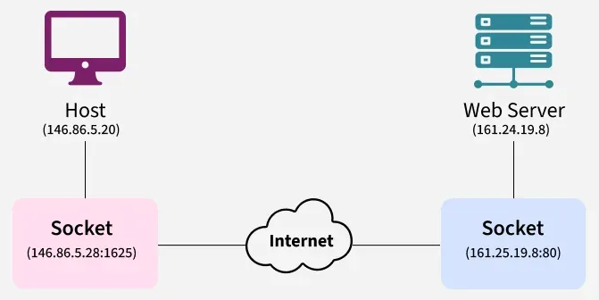
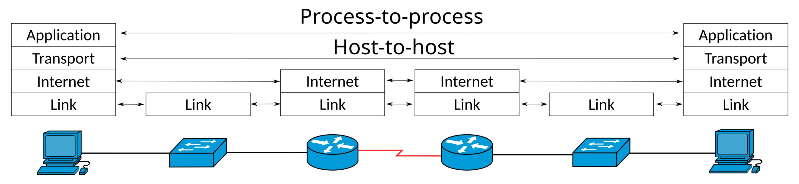
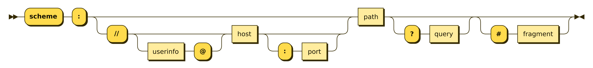

# [Network Performance](./network-performance/network-performance.md)
- ### [Data Transfer Rate](./network-performance/data-transfer-rate.md)

# Elements of Computer Network
- ### Node
    
- ### Port
    - ### list of TCP/UDP Ports
        
    - ### [Network Mapper (Nmap)](./networking-tools/nmap.md)
- ### [Packet](packet.md)
- ### Socket
    
- ### [Routing](routing.md)
- ### [Switching](switching.md)
- ### Network Address Translation (NAT)
    - ### Port Forwarding
        
- ### [Internet Service Provider (ISP)](isp.md)
- ### [Communication Protocol](./communication-protocol/communication-protocol.md)

# Network Access
- ### [Internet Access](./network-access/internet-access.md)
- ### [Multiple Access](./network-access/multiple-access.md)
- ### Network Access Control (NAC)

# Networking Hardware
- ### [Networking Hardware](networking-hardware.md)

# Network Topology
- ### Point-to-point topology
    
- ### Bus topology
    
- ### Ring topology
    
- ### Star topology
    
- ### Tree topology
    
- ### Mesh topology
    
- ### Hybrid topology
    - #### combines two or more network topology types

# Types of Computer Networks

    

- ### Nanonetwork
- ### Personal Area Network(PAN)
    

    - ### Wireless PAN(WPAN)
        - Bluetooth
        - Li-Fi
- ### Local Area Network(LAN)
    

    - ### Wireless LAN(WLAN)
        - Wi-Fi
        - Wireless USB
            
            
        - Hotspot
    - ### Virtual Local Area Network(VLAN)
    - ### Home Area Network(HAN)
- ### Campus Area Network(CAN)
    
- ### Metropolitan Area Network(MAN)
    
- ### Radio Access Network(RAN)
- ### Wide Area Network(WAN)
    
- ### Virtual Private Network(VPN)

# Firewall
- ### Network Firewall
    
- ### Web Application Firewall(WAF)

# End-to-End principle (E2E Principle)
- ### Layers of End-to-End
    
    
    - #### Process-to-Process
    - #### Host-to-Host
- ### [End-to-End Throughput](./network-performance/data-transfer-rate.md#end-to-end-throughput)

# World Wide Web (WWW)
- ### Uniform Resource Identifier (URI)
    - ### Uniform Resource Locator (URL)
    - ### URI Format = scheme: [//[authority](#authorityuserpassword-host-port)] /path [?query] [#fragment]
        

        - ### authority：[user:password@] host [:port]
- ### Hypertext
    - ### [HyperText Transfer Protoco (HTTP)](./communication-protocol/protocol-layer/http.md)
    - ### [HTTP Secure (HTTPS)](./communication-protocol/protocol-layer/protocol-layer.md#http-secure-https)
    - ### [HyperText Markup Language (HTML)](../../coding/markup-language/html/html.md)

# History of the Internet
- ### [History of the Internet](history-of-the-internet.md)

# MIME Type(Media Type)
- ### Text
    - #### text/plain(.txt)
    - #### text/html(.html)
- ### Image
    - #### image/png(.png)
    - #### image/jpeg(.jpg, .jpeg)
    - #### image/webp(.webp)
    - #### image/svg+xml(.svg)
    - #### image/gif(.gif)
- ### Audio
    - #### audio/mpeg(.mp3)
    - #### audio/ogg(.ogg)
    - #### audio/wave(.wav)
    - #### audio/webm(.webm)
- ### Video
    - #### video/mpeg(.mpeg)
    - #### video/mp4(.mp4)
- ### Application
    - #### application/x-msdownload(.exe)
    - #### application/pdf(.pdf)

# Organization
- ### Internet Corporation for Assigned Names and Numbers(ICANN)
    - #### manage：IP address, DNS
- ### Federal Communications Commission(FCC)
    - #### net neutrality
        
