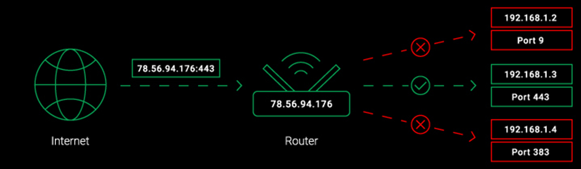
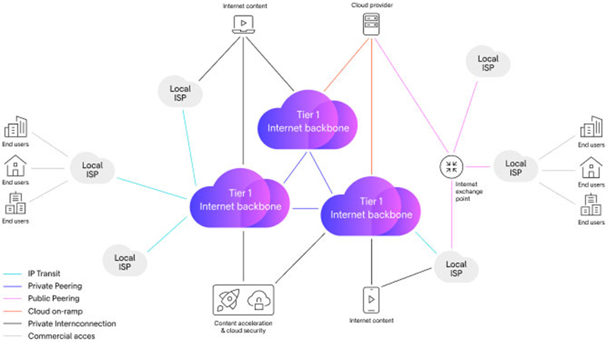
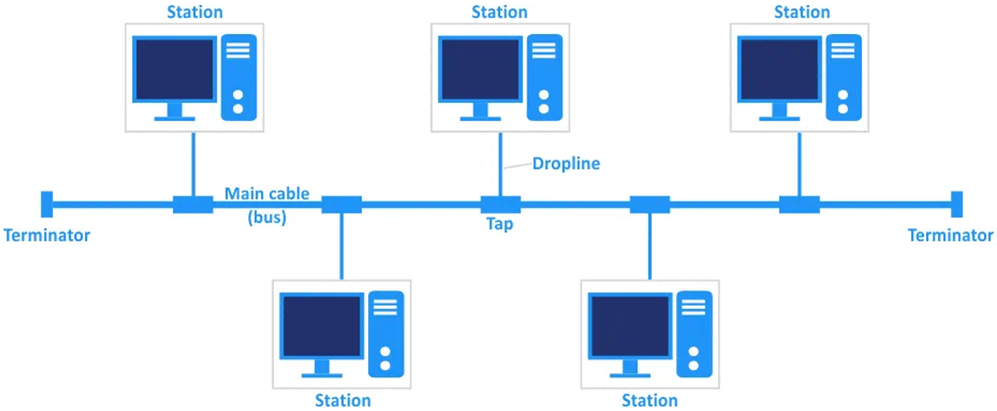
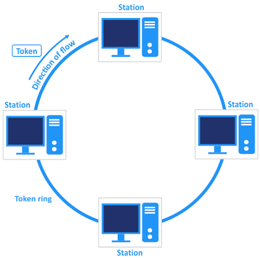
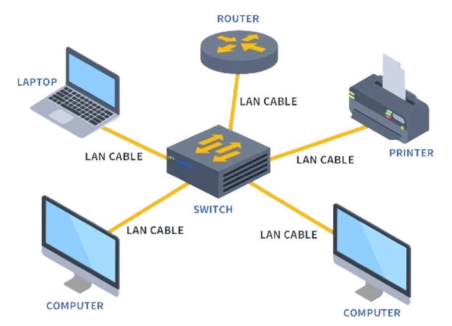
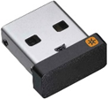
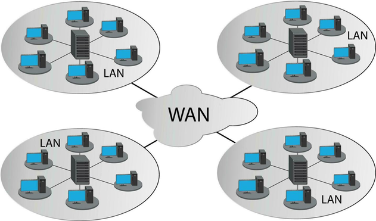
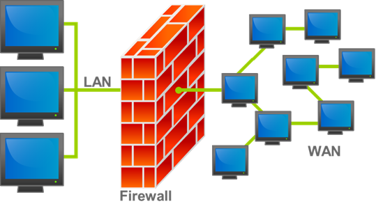

- ### Bandwidth
  - ### Narrowband
  - ### Broadband：the wide-bandwidth data transmission
  - ### Ultra-Wideband(UWB)
- ### Data Transfer Rate
  - ### upload speed
  - ### download speed
- ### Latency
  - ### ping
    
- ### Throughput
- ### Quality of Service(QoS)
---
- ### Node
    
- ### Packet
  - ### Packet Switching
    
  - ### Acknowledgement(ACK)
    - Negative Acknowledgement(NAK)
  - ### [Wireshark](wireshark.md)
- ### Port
  - ### list of TCP/UDP Ports
    
  - ### [Nmap](nmap.md)
- ### Network Address Translation(NAT)
  - #### Port Forwarding
    

# Communication Protocol
- ### [Communication Protocol](./communication-protocol/communication-protocol.md)

# Internet Backbone→ISP

    

- ### Internet Backbone
  - #### eg：AT&T、IBM、中華電信
- ### Internet Service Provider(ISP)
  - #### eg：中華電信、遠傳電信、台灣大哥大

# Networking Hardware
- ### Hub
    
- ### Switch
    
- ### Gateway
- ### Modem
  - #### phone modem
    
  - #### cable modem
    
  - #### DSL modem
     

     - Digital Subscriber Line(DSL)
- ### Router
    
---

    

# Network Topology
- ### Point-to-point topology
    
- ### Bus topology
    
- ### Ring topology
    
- ### Star topology
    
- ### Tree topology
    
- ### Mesh topology
    
- ### Hybrid topology
  - #### combines two or more network topology types

# Types of Computer Networks

    

- ### Nanonetwork
- ### Personal Area Network(PAN)
    

  - #### Wireless PAN(WPAN)
    - Bluetooth
    - Li-Fi
- ### Local Area Network(LAN)
    

  - ### Wireless LAN(WLAN)
    - ### Wi-Fi
    - ### Wireless USB
        
  - ### Virtual Local Area Network(VLAN)
- ### Campus Area Network(CAN)
    
- ### Metropolitan Area Network(MAN)
    
- ### Wide Area Network(WAN)
    
- ### Virtual Private Network(VPN)

# Firewall
- ### Network Firewall
    
- ### Web Application Firewall(WAF)

# Multiple Access
- ### Random Access
  - #### Aloha
    - Pure Aloha
    - Slotted Aloha
  - #### Carrier Sense Multiple Access(CSMA)
    - CSMA/CD
    - CSMA/CA
- ### Multiplexing
    |Multiplexing|Multiple Access|
    |:---:|:---:|
    |Frequency-Division Multiplexing(FDM)|Frequency-Division Multiple Access(FDMA)|
    |Time-Division Multiplexing(TDM)|Time-Division Multiple Access(TDMA)|
    |Code-Division Multiplexing(CDM)|Code-Division Multiple Access(CDMA)|
    - ### Multiplexing Device：Multiplexer(MUX)

# MIME Type(Media Type)
- ### Text
  - #### text/plain(.txt)
  - #### text/html(.html)
- ### Image
  - #### image/png(.png)
  - #### image/jpeg(.jpg, .jpeg)
  - #### image/webp(.webp)
  - #### image/svg+xml(.svg)
  - #### image/gif(.gif)
- ### Audio
  - #### audio/mpeg(.mp3)
  - #### audio/ogg(.ogg)
  - #### audio/wave(.wav)
  - #### audio/webm(.webm)
- ### Video
  - #### video/mpeg(.mpeg)
  - #### video/mp4(.mp4)
- ### Application
  - #### application/x-msdownload(.exe)
  - #### application/pdf(.pdf)

# Organization
- ### Internet Corporation for Assigned Names and Numbers(ICANN)
  - #### manage：IP address, DNS
- ### Federal Communications Commission(FCC)
  - #### net neutrality
    
