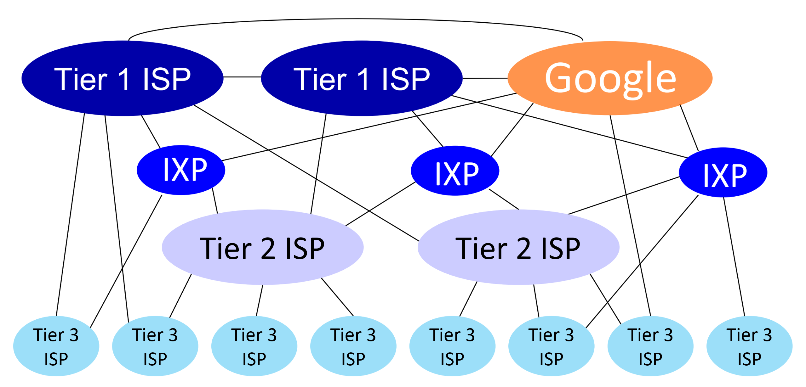
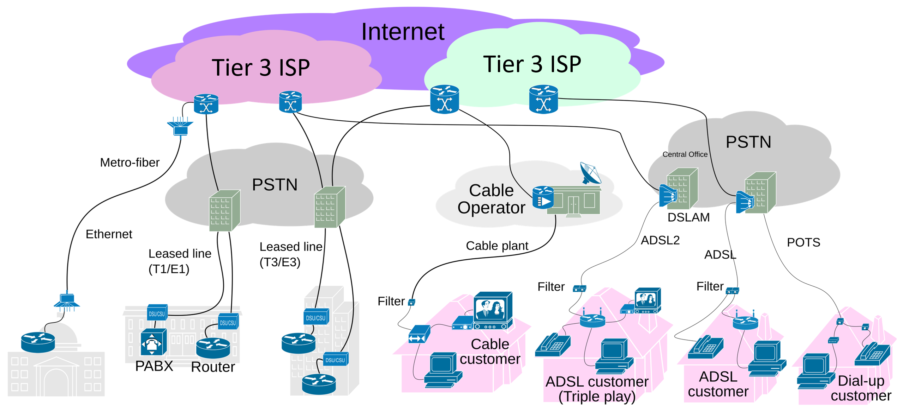
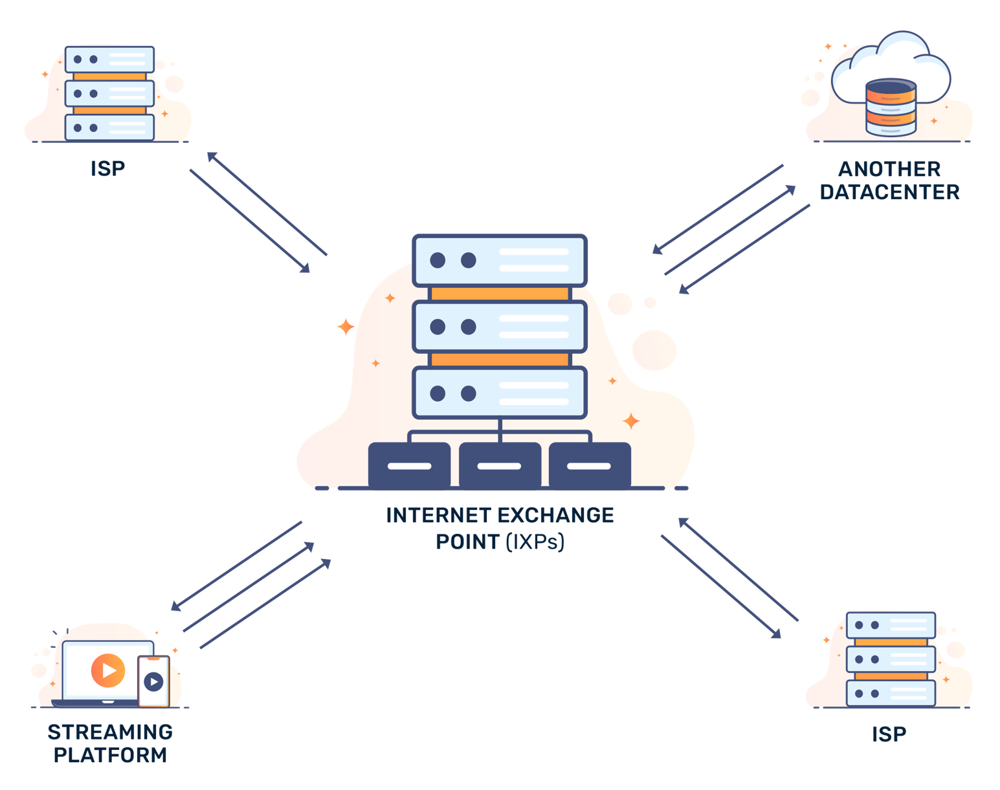

# Internet Service Provider (ISP)
- ### Tier 1 ISP → Tier 2 ISP → [Tier 3 ISP (Access ISP)](#tier-3-isp-access-isp--end-systems)
    
    
    - ### Tier 3 ISP (Access ISP) → End Systems
        
- ### Traffic Exchange (between ISP)
    - ### IP Transit
    - ### Peering
        - Public Peering
        - Private Peering
    - ### [Internet Exchange Point (IXP)](#internet-exchange-point-ixp-1)
- ### eg：中華電信、遠傳電信、台灣大哥大

# Internet Backbone

- ### [Switching](switching.md)
- ### eg：AT&T、IBM、中華電信

# Internet Exchange Point (IXP)

