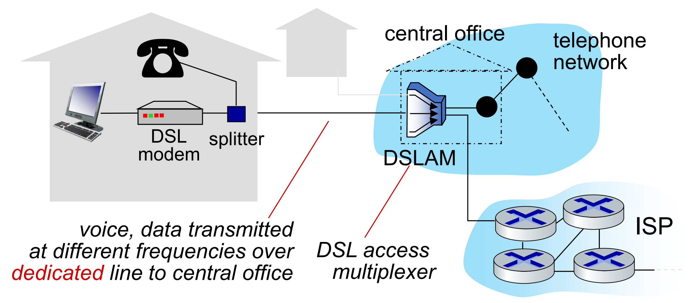

# Internet Access
- ### Internet Access：LAN→ISP
- ### Last Mile

# Types of Internet Access
- ### Broadband Internet
    - ### [Cable Internet(Coaxial Cable Internet)](#cable-internetcoaxial-cable-internet-1)
    - ### [Fiber Internet](#fiber-internet-1)
- ### [Digital Subscriber Line(DSL)](#digital-subscriber-linedsl-1)
- ### [Wireless Network](wireless-network.md)
- ### [Satellite Internet](#satellite-internet-1)

# Cable Internet(Coaxial Cable Internet)
- ### Hybrid Fiber-Coaxial(HFC)
- ### [Cable Modem](computer-networking.md#cable-modem)

# Fiber Internet
- ### Fiber To The x(FTTx)
    - ### Fiber To The Home(FTTH)

# Digital Subscriber Line(DSL)

- ### Digital Subscriber Line Access Multiplexer(DSLAM)
- ### [DSL Modem](computer-networking.md#dsl-modem)

# Satellite Internet
- ### Communications Satellite