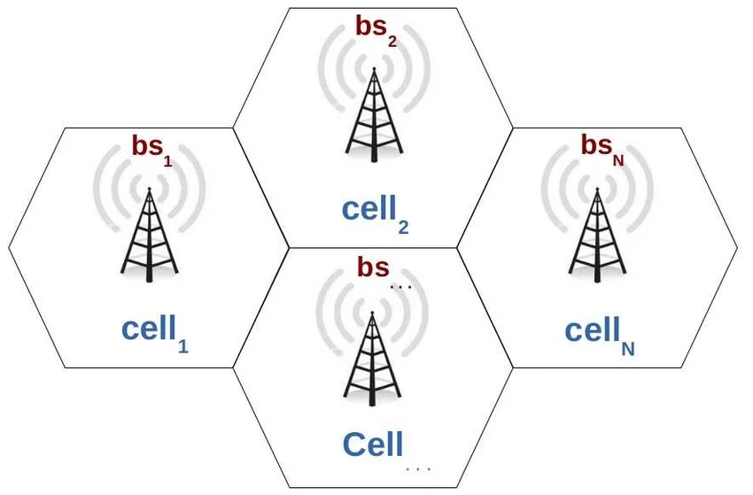
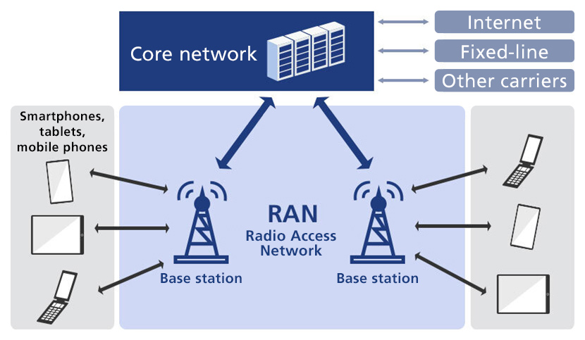
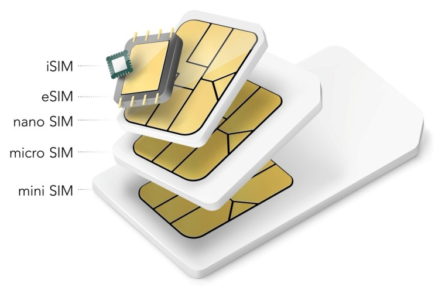

# Types of Cellular Network (Mobile Network)
- ### 5th-Generation Mobile Network (5G)
- ### 4th-Generation Mobile Network (4G)
- ### 3th-Generation Mobile Network (3G)
- ### 2nd Generation Mobile Network (2G)
    - #### Base Transceiver Station (BTS)：[Base Station](#base-station-bs) in 2G
    - #### Mobile Station (MS)：[User Equipment](#user-equipment-ue) in 2G

# Cellular Network (Mobile Network)

- ### [Core Network](#core-network) $\to$ [RAN](#radio-access-network-ran) $\to$ [User Equipment](#user-equipment-ue)
    
- ### Core Network
    - #### [Switching](../../switching.md)
- ### Radio Access Network (RAN)
    - #### Base Station (BS)
- ### User Equipment (UE)
    - #### [Subscriber Identity Module Card (SIM Card)](#subscriber-identity-module-card-sim-card-1)

# Subscriber Identity Module Card (SIM Card)

- ### Stanard SIM Card (Mini SIM Card)
- ### Micro SIM Card
- ### Nano SIM Card
- ### embedded-SIM (eSIM)
- ### integrated SIM (iSIM)

# Global System for Mobile Communications (GSM)
- ### Short Message Service (SMS)
- ### Roaming
    - #### Data Roaming

# Personal Communication Service (PCS)

# 3rd Generation Partnership Project (3GPP)

