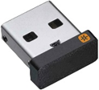

# Cellular Network (Mobile Network)
- ### [Cellular Network (Mobile Network)](cellular-network.md)

# Wireless LAN (WLAN)
- ### Wireless Access Point (WAP)
- ### Wi-Fi
- ### Li-Fi
- ### Hotspot

# Wireless PAN (WPAN)
- ### Bluetooth
- ### Wireless [USB](../../../computer-hardware/computer-hardware.md#universal-serial-bus-usb)
    

# Internet of Things (IoT)
