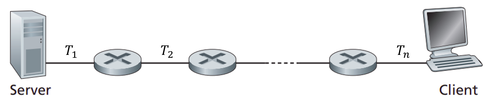

# Data Transfer Rate
- ### Data Transfer Rate：$`R=\frac{\text{Amount of Data (bits)}}{\text{Transfer Time (s)}}`$
- ### Types of Data Transfer Rate
    - #### upload speed
    - #### download speed
- ### [Data Transfer Rate Unit](#data-transfer-rate-unit-1)
- ### [Data Transfer Rate Metrics](#data-transfer-rate-metrics-1)
    - ### [Bandwidth](#bandwidth-1)
    - ### [Throughput](#throughput-1)
    - ### [Unit](../../../../unit.md) (Bandwidth, Throughput)：[Data Transfer Rate Unit](#data-transfer-rate-unit-1)

# Data Transfer Rate [Unit](../../../../unit.md)
- ### [bits](../../data-representation/data-representation.md#bit-decimal) per second (Decimal)
    |Unit|Name|Value|
    |:---:|:---:|:---:|
    |bps, b/s|bits per second|$1\text{ bps}$|
    |kbps, kb/s|kilobits per second|$10^3\text{ bps}$|
    |Mbps, Mb/s|Megabits per second|$10^6\text{ bps}$|
    |Gbps, Gb/s|Gigabits per second|$10^9\text{ bps}$|
- ### [bits](../../data-representation/data-representation.md#bit-binary) per second (Binary)
    |Unit|Name|Value|
    |:---:|:---:|:---:|
    |kibps|kibibits per second|$2^{10}\text{ bps}$|
    |Mibps|Mebibits per second|$2^{20}\text{ bps}$|
    |Gibps|Gibibits per second|$2^{30}\text{ bps}$|
- ### [Bytes](../../data-representation/data-representation.md#byte-decimal) per second
    |Unit|Name|Value|
    |:---:|:---:|:---:|
    |Bps, B/s|Bytes per second|$8\text{ bps}$|
    |kBps, kB/s|kiloBytes per second|$10^3\text{ Bps}=8\text{ Kbps}$|
    |MBps, MB/s|MegaBytes per second|$10^6\text{ Bps}=8\text{ Mbps}$|
    |GBps, GB/s|GigaBytes per second|$10^9\text{ Bps}=8\text{ Gbps}$|

# Bandwidth
- ### Bandwidth：the Maximum [Data Transfer Rate](#data-transfer-rate) across a channel
- ### Broadband：the wide-bandwidth
    - ### Ultra-Wideband (UWB)

# Throughput
- ### Throughput ($`T`$)：the Actual Rate of Successful Data transfer over a channel
- ### End-to-End Throughput
    
    
    - ### Instantaneous Throughput = $`T_i`$
    - ### Average Throughput = $`min(T_1,~T_2,~\cdots ,~T_n)`$    
        - Bottleneck Link

