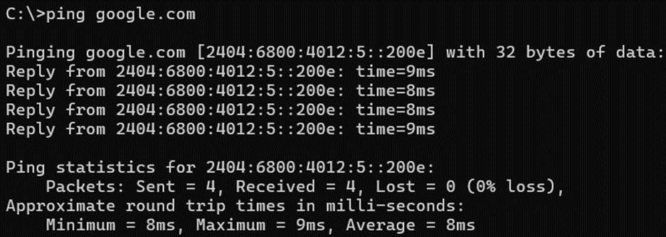
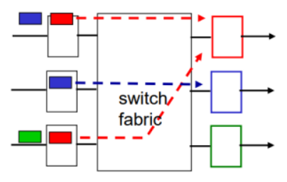
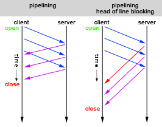
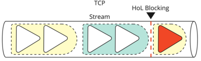

# Network Performance Measures
- ### [Data Transfer Rate](data-transfer-rate.md)
    - ### [Bandwidth](data-transfer-rate.md#bandwidth-1)
    - ### [Throughput](data-transfer-rate.md#throughput-1)
- ### [Latency](#latency-1)
    - ### [Delay](#delay-2)
- ### Jitter：Variation in [Latency](#latency-1)
    - ### [Unit](../../../../unit.md)：s (second), ms (millisecond)
- ### [Traffic Intensity](#traffic-intensity-1)
- ### Quality of Service (QoS)

# Latency
- ### [Unit](../../../../unit.md)：s (second), ms (millisecond)
- ### ping
    
- ### [Delay](#delay-2)

# Delay
- ### [Unit](../../../../unit.md)：s (second), ms (millisecond)
- ### Total Delay = $`D_{proc}+D_{que}+D_{tran}+D_{prop}`$
- ### Types of Delay：[Processing Delay](#processing-delay-) → [Queuing Delay](#queuing-delay-) → [Transmission Delay](#transmission-delay) → [Propagation Delay](#propagation-delay)
    - ### Processing Delay ($D_{proc}$)
    - ### Queuing Delay ($D_{que}$)
    - ### Transmission Delay：$`D_{tran}=\frac{L}{R}`$
        - $L$ = Packet Length (bits)
        - $R$ = [Data Transfer Rate](data-transfer-rate.md) (bps)
    - ### Propagation Delay：$`D_{prop}=\frac{d}{s}`$
        - $d$ = distance of link
        - $s$ = propagation speed
- ### Round-Trip Time (RTT)：the total time from a source to a destination and back

# Traffic Intensity
- ### Traffic Intensity：$`\frac{\text{Average Arrival Rate of bits (bps)}}{\text{Data Transfer Rate (bps)}}=\frac{aL}{R}=a\times D_{tran}`$
- #### Average Arrival Rate of bits (bps) = $aL$
    - $a$ = Average Arrival Rate of packet (packets per second)
    - $L$ = Average Packet Length (bits)
- #### [Data Transfer Rate](data-transfer-rate.md) (bps)：$R=\frac{L}{D_{tran}}$
    - [Average Transmission Delay](#transmission-delay) (s)：$D_{tran}=\frac{L}{R}$

# Head-of-Line Blocking (HOL Blocking)
- ### Head-of-Line Blocking (HOL Blocking)：when a queue of packets is held up by the first packet in the queue
- ### Types of HOL Blocking
    |HOL Blocking|[Switch](../networking-hardware.md#switch) HOL Blocking|[HTTP](../communication-protocol/protocol-layer/application-layer/http.md) HOL Blocking|[TCP](../communication-protocol/protocol-layer/transport-layer/tcp.md) HOL Blocking|
    |:---:|:---:|:---:|:---:|
    |||||
    |**Location**|[Switch](../networking-hardware.md#switch)|[Pipelining (HTTP/1.1)](../communication-protocol/protocol-layer/application-layer/http.md#pipelining-http11)|[TCP](../communication-protocol/protocol-layer/transport-layer/tcp.md), [Multiplexing (HTTP/2)](../communication-protocol/protocol-layer/application-layer/http.md#multiplexing-over-a-single-tcp-connection-http2)|
    |**Solution**|Virtual Output Queues (VOQ)|[Multiplexing (HTTP/2)](../communication-protocol/protocol-layer/application-layer/http.md#multiplexing-over-a-single-tcp-connection-http2)|[QUIC](../communication-protocol/protocol-layer/protocol-layer.md#quic)|

