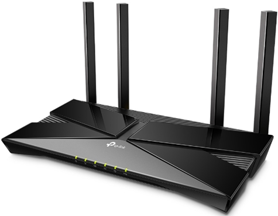

# Networking Hardware
- ### Hub
    
- ### Switch
    
- ### Gateway
- ### [Modem](#modulator-demodulator-modem)
- ### Router
    

    - #### [Routing](routing.md)
- ### Network Interface Card (NIC)
- ### Transmission Medium
    - ### Coaxial Cable
    - ### Optical Fiber
    - ### [Twisted Pair](#twisted-pair-1)

# Modulator-Demodulator (Modem)
- ### Phone Modem
    
- ### Cable Modem
    
- ### DSL Modem
    

# Twisted Pair
- ### Types of Twisted Pair
    - #### Unshielded Twisted Pair(UTP)
    - #### Foiled Twisted Pair(FTP)
    - #### Shielded Twisted Pair(STP)
- ### Category of Twisted Pair
    |Category|Bandwidth|Application|
    |:---:|:---:|:---:|
    |Category 3 (Cat 3)|16 MHz|Plain Old Telephone Service|
    |Category 4 (Cat 4)|20 MHz||
    |Category 5 (Cat 5)|100 MHz|Fast Ethernet|
    |Category 5 Enhanced (Cat 5e)|100 MHz|Gigabit LAN|
    |Category 6 (Cat 6)|250 MHz|10 Gigabit Ethernet (55m)、Gigabit LAN (100m)|
    |Augmented Category 6 (Cat 6A)|500 MHz|10 Gigabit Ethernet (100m)|
    |Category 7 (Cat 7)|600 MHz|Data Center|
    |Category 8 (Cat 8)|2 GHz|High-Performance Data Center|

