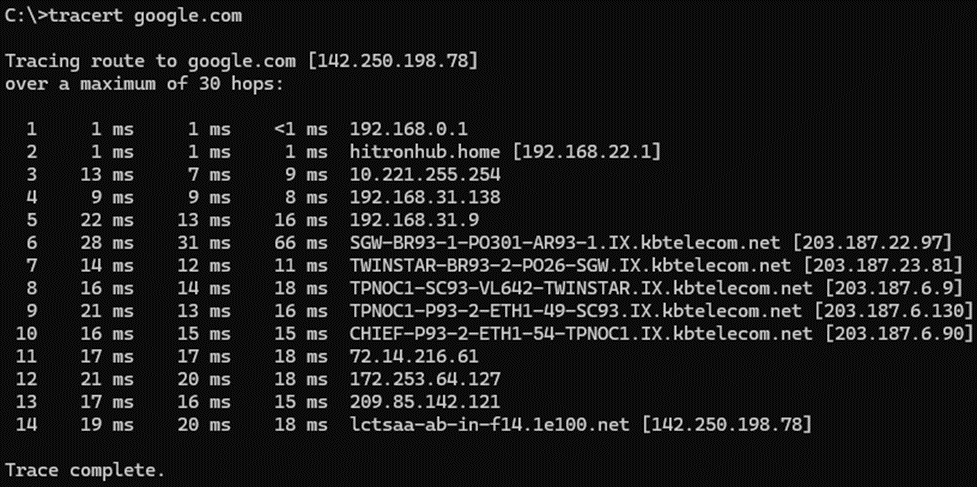

# Routing
- ### Routing Algorithm
    - #### Link State Routing 
    - #### Distance Vector Routing
- ### Routing Table
- ### [Router](networking-hardware.md#router)
- ### Traceroute (tracert)
    

# Routing Protocol
- #### Routing Information Protocol (RIP)
- #### Open Shortest Path First (OSPF)
