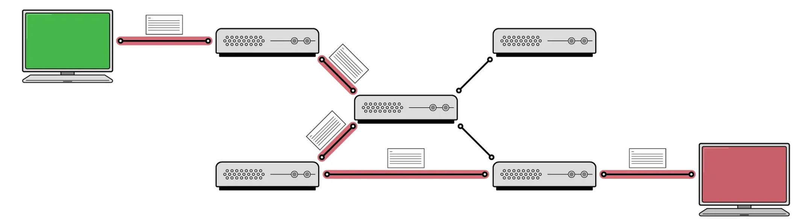

# Switching
||[Circuit Switching](#circuit-switching)|[Packet Switching](#packet-switching)|
|:---:|:---:|:---:|
|**Connection**|Connection-Oriented|Connectionless|
|**Path**|Dedicated Path|No Dedicated Path|
|**Bandwidth**|Reserved|Dynamic, Shared|
|**Reliability**|High|Low|
|**Latency**|Low, Constant|High, Variable|
|**Efficiency**|Low (wastes idle resources)|High (resource shared)|
|**Application**|Real-time applications (PSTN, ISDN)|Internet (email, web, file transfer)|

# Circuit Switching

- ### Phases：Connection Setup → Data Transfer → Connection Release
- ### [Multiplexing](./network-access/multiple-access.md#multiplexing)

# Packet Switching

    
- ### Phases：Store and Forward
- ### [Types of Delay](./network-performance/network-performance.md#delay-2)：[Processing Delay](./network-performance/network-performance.md#processing-delay) → [Queuing Delay](./network-performance/network-performance.md#queuing-delay) → [Transmission Delay](./network-performance/network-performance.md#transmission-delay) → [Propagation Delay](./network-performance/network-performance.md#propagation-delay)
- ### [ARPANET](history-of-the-internet.md#advanced-research-projects-agency-network-arpanet)：the first packet-switched network

