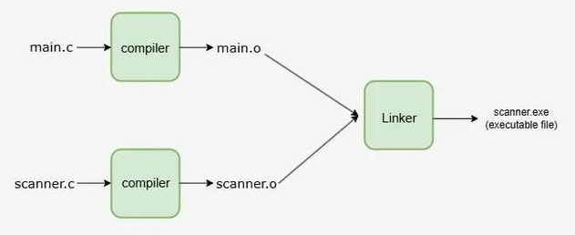

# Linker

- ### [Object code](build-process.md#object-code) + $\cdots$ +  [Object code](build-process.md#object-code) + [Library Files](build-process.md#library) $`\overset{\text{Linker}}{\longrightarrow}`$ [Executable code](build-process.md#executable-code)

# Types of Linking
- ### Static Linking
- ### Dynamic Linking
    - #### Implicit Dynamic Linking
    - #### Explicit Dynamic Linking

# Library
- ### Static Library
- ### Dynamic-Link Library (DLL)
- ### Shared Library
