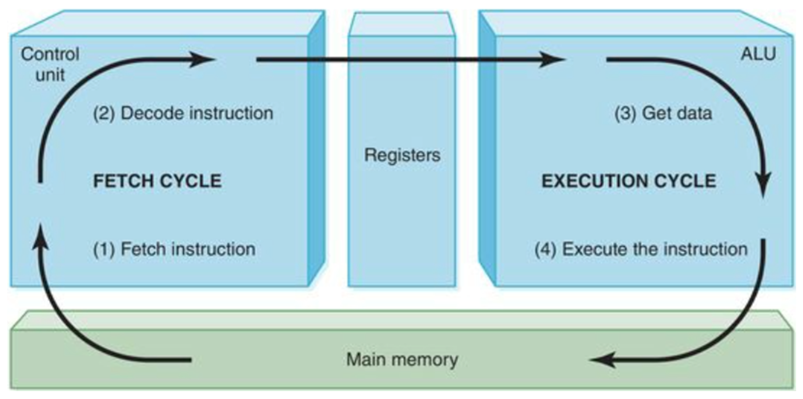

# [Computer Architecture](../computer-hardware/computer-hardware.md#computer-architecture)
- ### [Units of Computer](../computer-hardware/computer-hardware.md#units-of-computer)

# [Instruction Set Architecture (ISA)](isa/isa.md)
- ### [Memory Addressing in ISA](isa/memory-addressing-in-isa/memory-addressing-in-isa.md)
- ### [Microprocessor without Interlocked Pipeline Stages (MIPS)](isa/mips/mips.md)

# Instruction Cycle

# Computer Operation
- ### Programmable
- ### Store
- ### Retrieve
- ### Process

# [Build Process](./build-process/build-process.md)
- ### [Linker](./build-process/linker.md)
- ### [Loader](./build-process/loader.md)

# Modes of Data Transfer
- ### Direct Memory Access (DMA)
- ### Programmed Input/Output (PIO)
- ### Interrupt-Driven Input/Output (Interrupt-Driven I/O)

# System Clock
- ### [System Clock](system-clock.md)

# Sequential Processing
- ### Single-cycle Processor
- ### Multi-cycle Processor

# [Parallel Computing](./parallel-computing/parallel-computing.md)
- ### [Pipeline](./parallel-computing/pipeline/pipeline.md)
- ### [Tomasulo Algorithm](./parallel-computing/tomasulo-algorithm.md)

# Virtualization
- ### [Virtualization](./virtualization/virtualization.md)

# Embedded system
- ### based on Microprocessor
- ### dedicated to specific tasks

