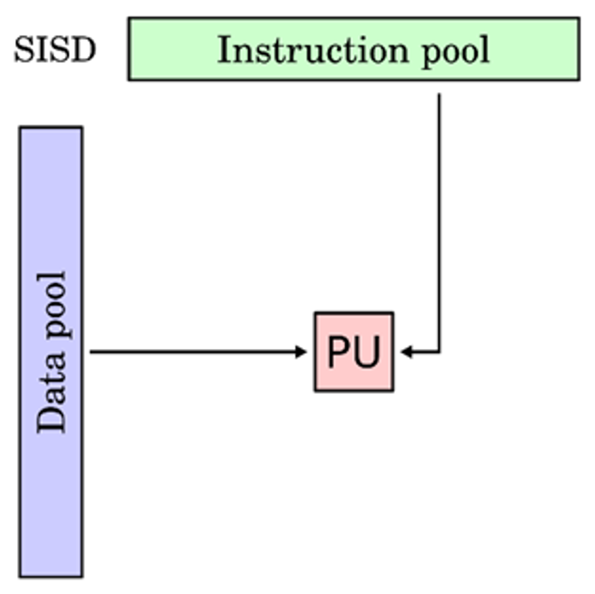
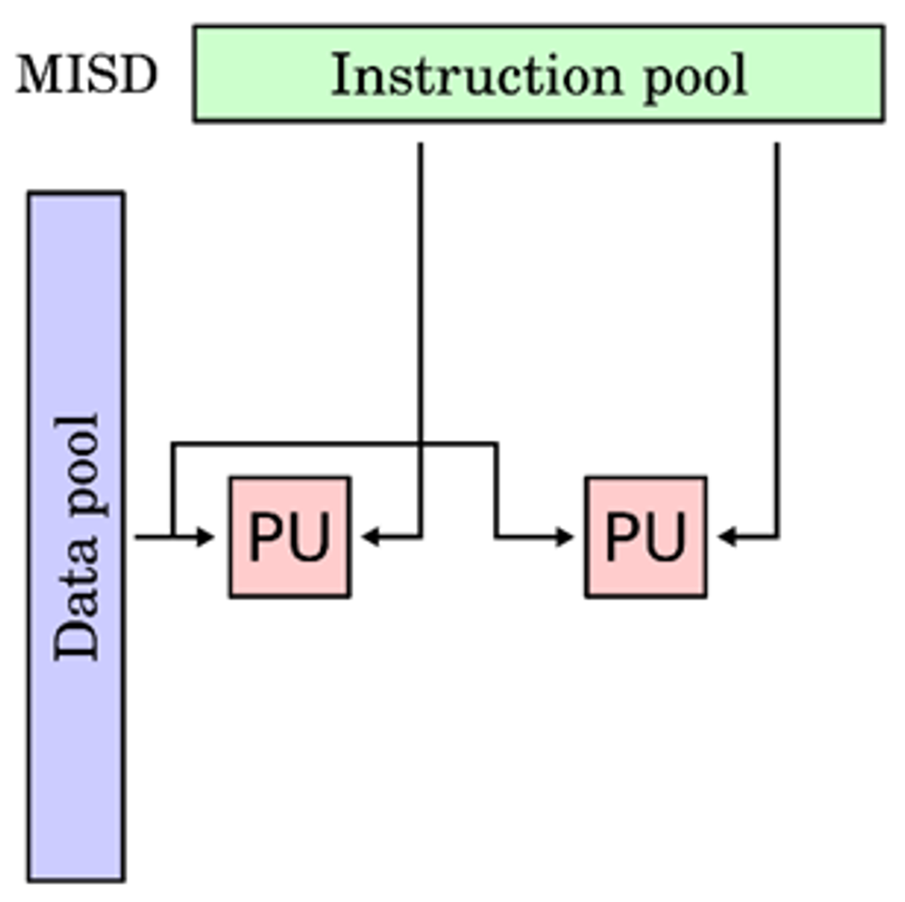
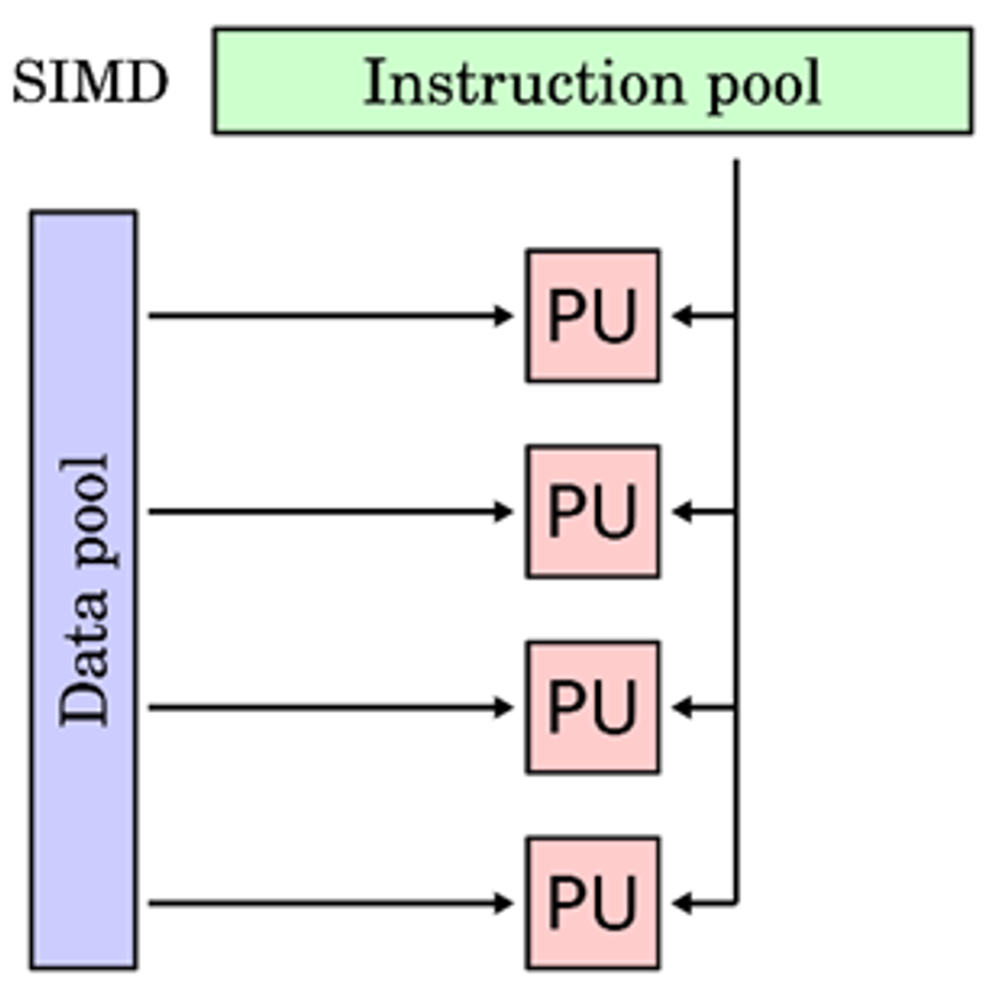
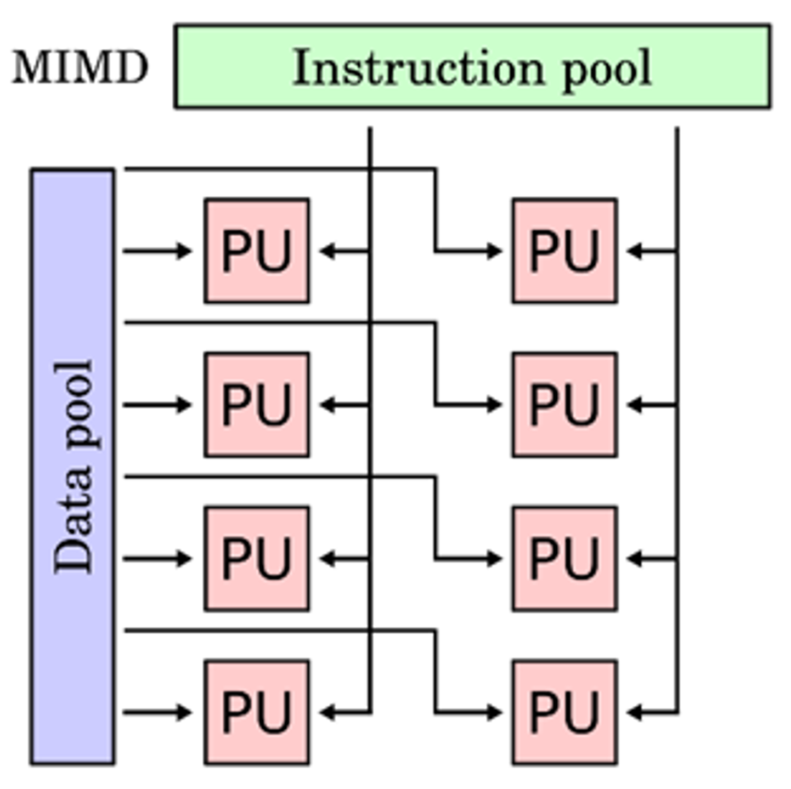
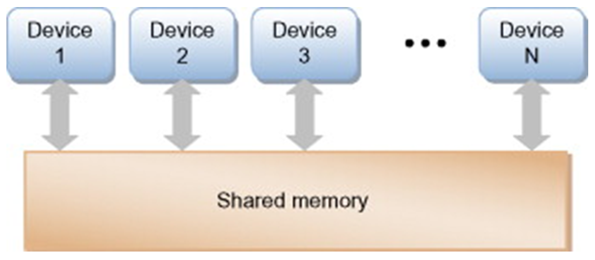

# Types of Parallelism
- ### Bit-Level Parallelism (BLP)
- ### Instruction-Level Parallelism (ILP)
- ### Data-Level Parallelism (DLP)
- ### Task-Level Parallelism (TLP)

# Flynn's Taxonomy
||Single Instruction (SI)|Multiple Instruction (MI)|
|:--:|:--:|:--:|
|**Single Data (SD)**|||
|**Multiple Data (MD)**|||

# Amdahl's Law

# [Pipeline](./pipeline/pipeline.md)
- ### [Pipeline Hazard](./pipeline/pipeline-hazard.md)

# Out-of-Order Execution
- ### Scoreboarding
- ### [Tomasulo Algorithm](tomasulo-algorithm.md)

# Shared Memory

