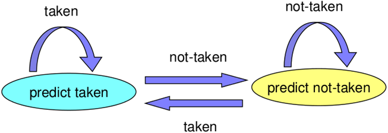
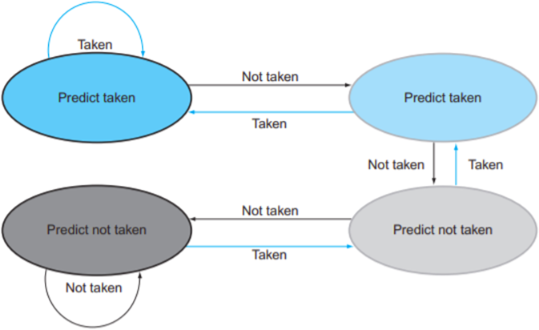

# Pipeline Hazard
- ### Structural Hazard：多個指令同時使用同一個硬體
- ### Data Hazard：後面的指令需要前面的指令尚未產生的資料
- ### Control Hazard：branch指令尚未決定是否branch，而branch後的指令已經在執行了

# Pipeline Hazard Solution
- ### Pipeline Stall
    - #### No Operation(NOP)
- ### Instruction Scheduling
- ### Instruction Flushing
- ### Structural Hazard Solution
    - #### Duplicate hardware resources
- ### Data Hazard Solution
    - #### Forwarding
        - Forward Unit
    - #### Register Renaming
- ### Control Hazard Solution
    - #### Branch Prediction
        - Static Branch Prediction
        - [Dynamic Branch Prediction](#dynamic-branch-prediction)
    - #### Speculative Execution
    - #### Delayed Branch

# Dynamic Branch Prediction
- ### 1-bit Predictor
    
- ### 2-bit Predictor
    

