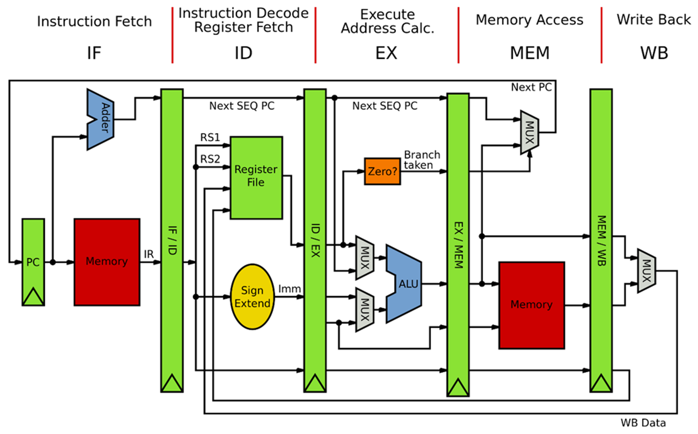
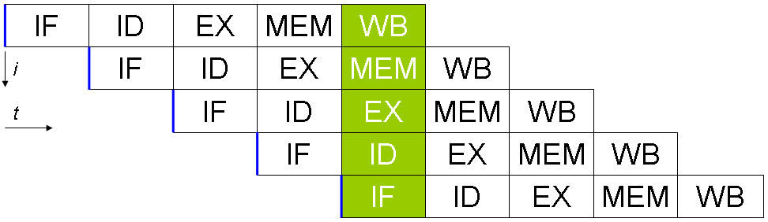

# Types of Pipelines
- ### Instruction Pipeline
- ### Arithmetic Pipeline

# [Pipeline Hazard](pipeline-hazard.md)
- ### [Pipeline Hazard Solution](pipeline-hazard.md#pipeline-hazard-solution)

# Five-Stage Pipeline

- ### Five-Stage
    

    - #### Instruction Fetch (IF)
    - #### Instruction Decode & Register Read (ID)
    - #### Execution or Address Calculation (EX)
    - #### Memory Access (MEM)
    - #### Write Back (WB)
- ### Pipeline Register：register between stages
    - #### IF/ID, ID/EX, EX/MEM, MEM/WB

