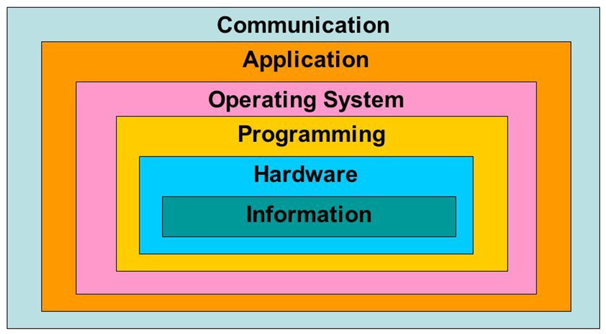

# Layers of Computer Architecture

    

# Abstraction
- ### Rationale：a mental model that removes or hides complex details
- ### Information Hiding
- ### Abstract Data Type(ADT)

# [Computer Organization and Architecture](./computer-organization-and-architecture/computer-organization-and-architecture.md)
- ### [Instruction Set Architecture(ISA)](./computer-organization-and-architecture/isa/isa.md)
- ### Pipeline
- ### System Clock

# Computer Hardware
- ### Memory

# [Computer Networking](./computer-networking/computer-networking.md)
- ### [Communication Protocol](./computer-networking/communication-protocol/communication-protocol.md)

# Distributed Computing
- ### Distributed Computing

# Operating System
- ### Operating System

# Data Representation
- ### Number System

# Data Management
- ### Data Management

# History of Computing
- ### History of Computing Hardware
- ### History of Computing Software
