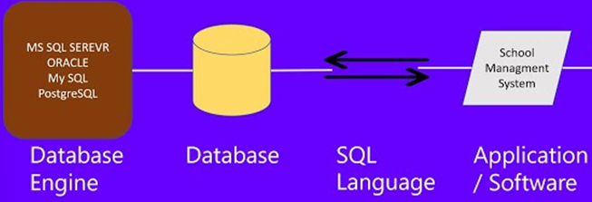
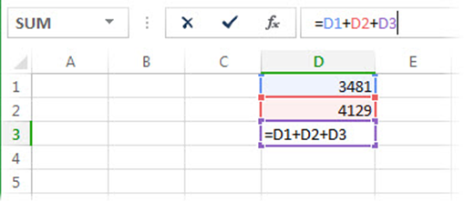

# Database Management System (DBMS)

- ### Query Language
    - #### [Structured Query Language (SQL)](../../coding/query-language/sql.md)
- ### Database Engine：a software that DBMS uses to [CRUD](#crud) data from database
    - #### Query Processor
- ### Database Schema
- ### [Relational DBMS (RDBMS)](./data-model/logical-data-model/relational-model.md#relational-dbms-rdbms)

# Data Model
- ### Conceptual Data Model
    - #### [Entity-Relationship Model (ER Model)](./data-model/conceptual-data-model/er-model.md)
- ### Logical Data Model
    - #### [Relational Model](./data-model/logical-data-model/relational-model.md)
    - #### Object-Oriented Model
- ### Physical data Model

# CRUD
- ### Create
- ### Read
- ### Update
- ### Delete

# Spreadsheet
- ### cell
    - #### row, column
    - #### range
- ### Circular Reference
    

# Data Engineering
- ### [Data Engineering](data-engineering.md)

# Data Mining

# Electronic Commerce(E-Commerce)
- ### Amazon
- ### eBay
- ### Uber Eats
- ### Netflix

