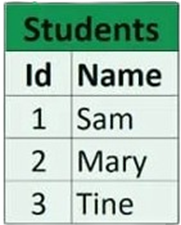
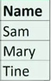

# Relational DBMS (RDBMS)
- ### MySQL

# Element
- ### table：a collection of records
- ### record、column、object、entity：a collection of related fields
- ### field、attributes：a single value
- ### key、id

# eg

- ### Database schema
    - #### Students：(Id(key), Name)
    - #### Courses：(Id(key), Name)
    - #### StudentCourses：(StudentId, CourseId)
- ### table
    
- ### record, column, object, entity
    
- ### field, attributes
    
- ### key, id
    
