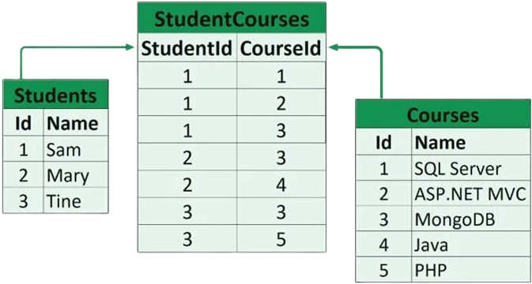

# Relational DBMS (RDBMS)
- ### MySQL

# Relation Schema

# [Keys](../../database-system.md#element) in Relational Model
- ### Super Key
- ### Candidate Key
- ### Primary Key
- ### Alternate Key (Secondary Key)
- ### Unique Key
- ### Composite Key
- ### Foreign Key
