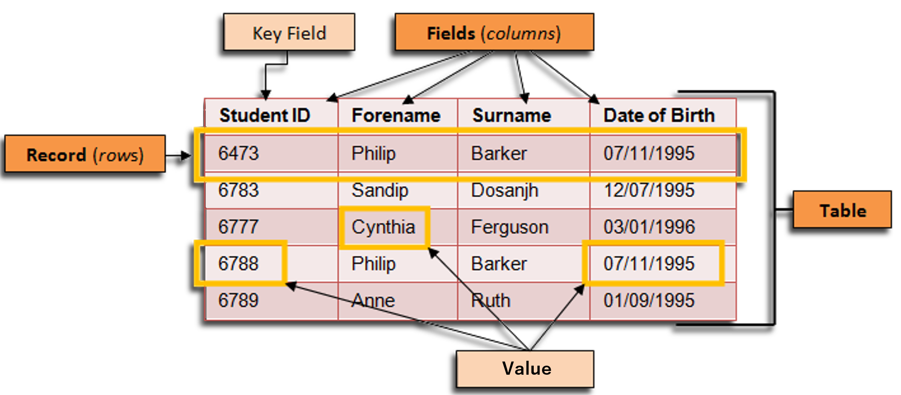

# Database Management System (DBMS)

- ### Query Language
    - #### [Structured Query Language (SQL)](../../coding/query-language/sql.md)
- ### Database Engine：a software that DBMS uses to [CRUD](#crud) data from database
    - #### Query Processor
- ### Database Schema
- ### [Relational DBMS (RDBMS)](./data-model/logical-data-model/relational-model.md#relational-dbms-rdbms)

# Data Model
- ### Conceptual Data Model
    - #### [Entity-Relationship Model (ER Model)](./data-model/conceptual-data-model/er-model.md)
- ### Logical Data Model
    - #### [Relational Model](./data-model/logical-data-model/relational-model.md)
    - #### Object-Oriented Model
- ### Physical data Model

# Element

|Element|Definition|
|:---:|:---:|
|Table|a collection of data organized in rows and columns|
|Record, Row, Tuple, Object, Entity|a horizontal entry|
|Field, Column, Attribute|a vertical category|
|Key, (Key Field, Id)|a unique identifier of data|
|Value|the specific data content identified or accessed by a key|

# Key–Value Database

# CRUD
- ### Create
- ### Read
- ### Update
- ### Delete
