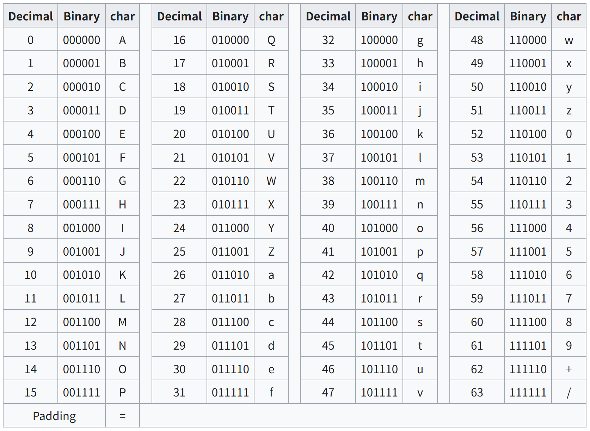
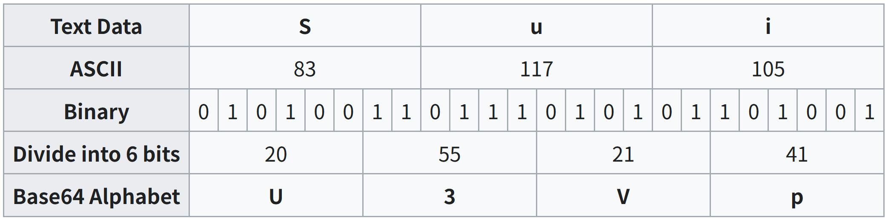

# Encoding
- ### ASCII
- ### Unicode
    - ### 8-bit Unicode Transformation Format (UTF-8)
- ### [Base64](#base64-1)
- ### Huffman encoding
- ### encodeURI/decodeURI

# ASCII

# Base64

- ### eg：Man→TWFu
    
 

